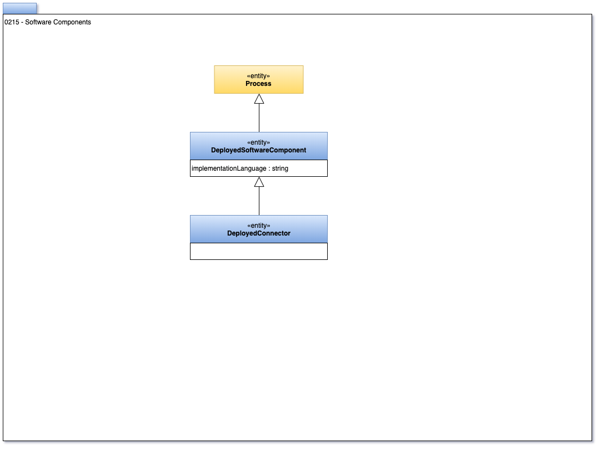

<!-- SPDX-License-Identifier: CC-BY-4.0 -->
<!-- Copyright Contributors to the Egeria project. -->

# 0215 Software Components

Software components describe the code assets that are deployed to implement software capabilities.

