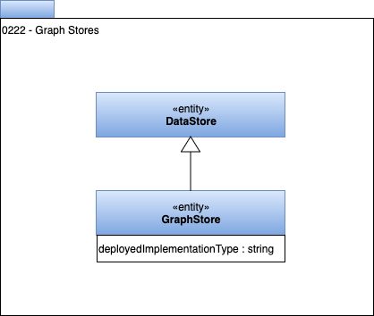

<!-- SPDX-License-Identifier: CC-BY-4.0 -->
<!-- Copyright Contributors to the Egeria project. -->

# 0222 Graph Stores

Graph stores describe a type of data store that has its content organized as a graph.

