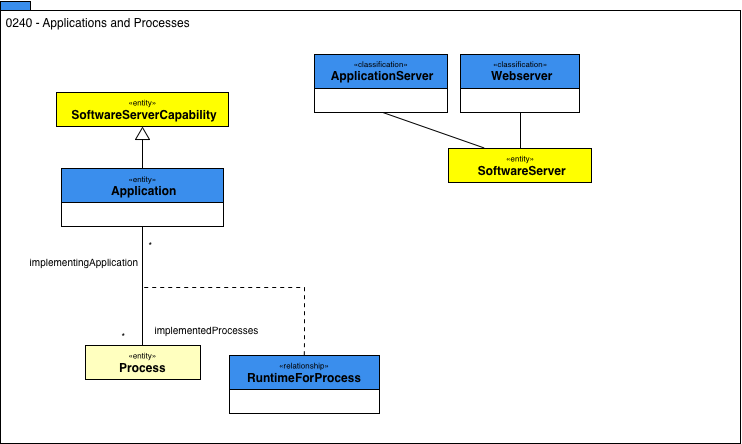

<!-- SPDX-License-Identifier: CC-BY-4.0 -->
<!-- Copyright Contributors to the ODPi Egeria project. -->

# 0240 Applications and Processes

Applications provide business or management logic.
They are often custom built but may also be brought as a package.
They are deployed onto a server.
Some applications are written to support specific processes.
Model 0240 shows how applications relate to processes and the servers that host them.

