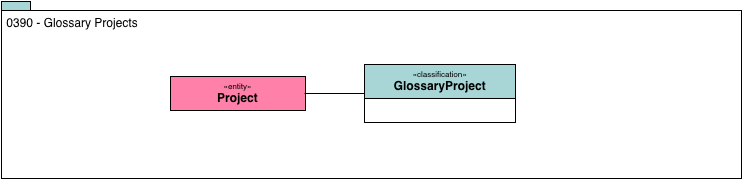

<!-- SPDX-License-Identifier: CC-BY-4.0 -->
<!-- Copyright Contributors to the ODPi Egeria project. -->

# 0390 Glossary Projects

A glossary project is used to develop new elements for the glossary.

