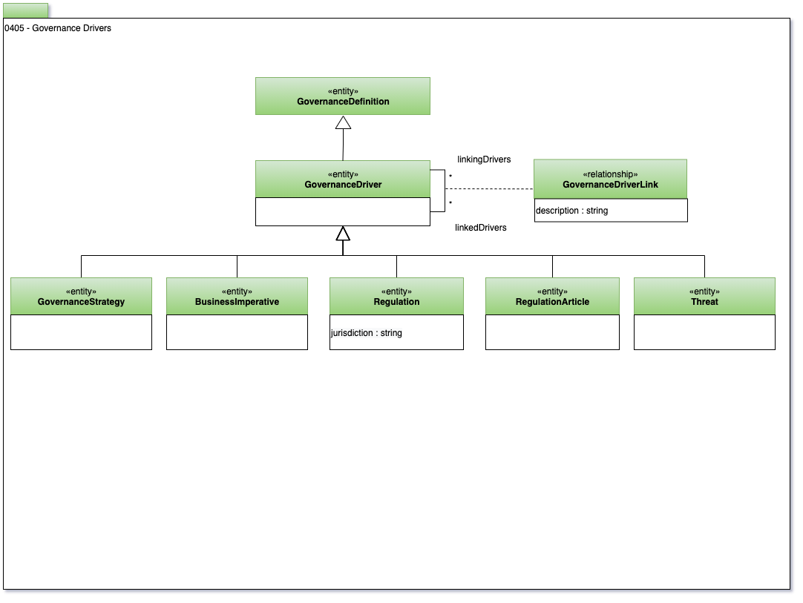

<!-- SPDX-License-Identifier: CC-BY-4.0 -->
<!-- Copyright Contributors to the Egeria project. -->

# 0405 Governance Drivers

Governance Drivers provide the core requirements of the governance program.
The **DataStrategy** is derived from the business strategy.
It defines how data supports the business strategy.
**Regulations** define legal requirements relating to data management.

Reconciling the data strategy with the regulations creates synergies
in an organization's approach to data management.

