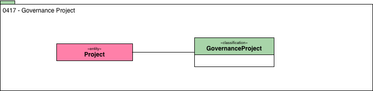

<!-- SPDX-License-Identifier: CC-BY-4.0 -->
<!-- Copyright Contributors to the Egeria project. -->

# 0417 Governance Projects

The roll-out of a governance program is typically divided into projects that are grouped together into a campaign
(see [Projects](0130-Projects.md) in Area 1).
The **GovernanceProject** classification tags these projects
so they are easy for the governance team to identify when it comes
to reporting.

