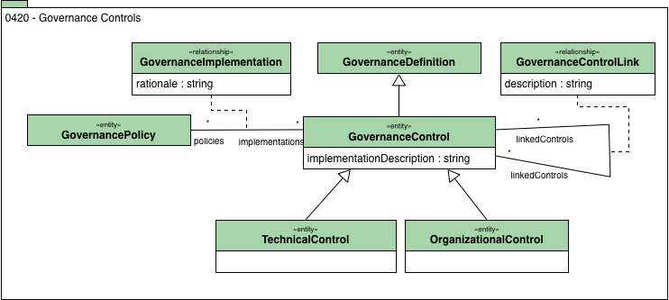

<!-- SPDX-License-Identifier: CC-BY-4.0 -->
<!-- Copyright Contributors to the Egeria project. -->

# 0420 Governance Controls

Governance is enabled through People, Process and Technology.
These are controlled through a combination of technical controls (implemented IT function) and organizational controls (training, responsibility, buddy-checking etc).

