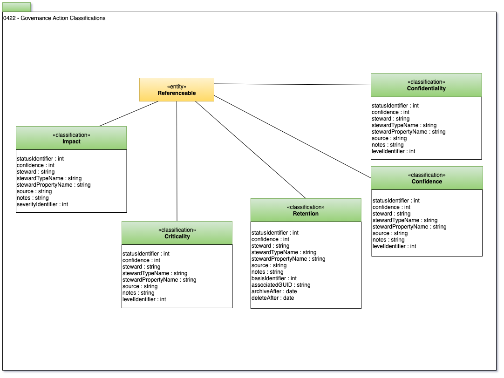

<!-- SPDX-License-Identifier: CC-BY-4.0 -->
<!-- Copyright Contributors to the Egeria project. -->

# 0422 Governance Action Classifications

Governance Action Classifications describe the common (ie typical) types of classifications
that are used in the governance controls.

