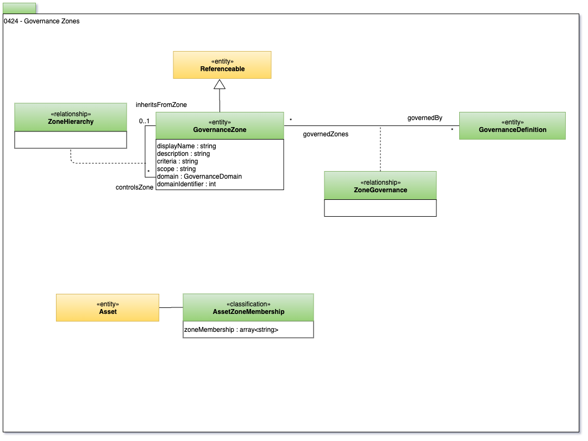

<!-- SPDX-License-Identifier: CC-BY-4.0 -->
<!-- Copyright Contributors to the ODPi Egeria project. -->

# 0424 Governance Zones

A **GovernanceZone** describes a collection of Assets that are used, or processed in a specific way.
An Asset may belong to many Governance Zones.

