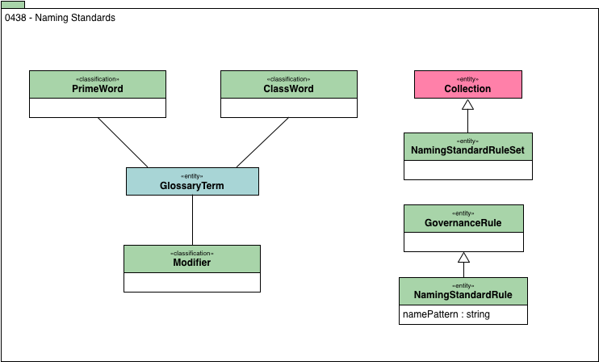

<!-- SPDX-License-Identifier: CC-BY-4.0 -->
<!-- Copyright Contributors to the ODPi Egeria project. -->

# 0438 Naming Standards

Naming standards provide means for classifying glossary terms to allow naming rules to use them.

