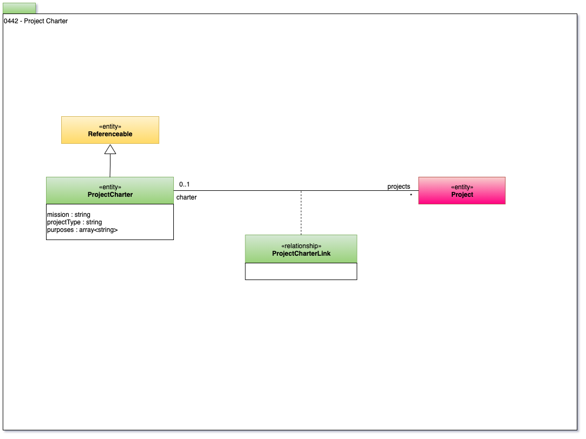

<!-- SPDX-License-Identifier: CC-BY-4.0 -->
<!-- Copyright Contributors to the Egeria project. -->

# 0442 Project Charter

The project charter defines the mission and purpose of the project.   The access to resources for a project may be partially controlled by the type/mission of the project.
For example, the purposes, specifically are used in GDPR scenarios.

