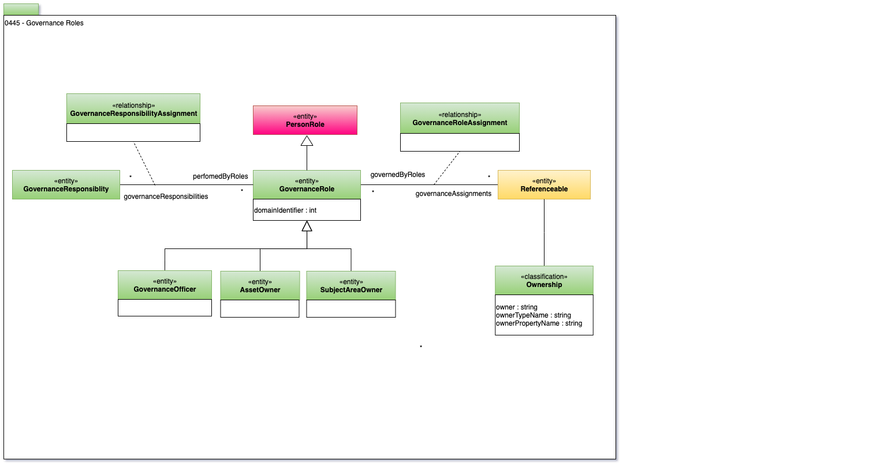

<!-- SPDX-License-Identifier: CC-BY-4.0 -->
<!-- Copyright Contributors to the ODPi Egeria project. -->

# 0445 Governance Roles

Someone or something needs to be identified as being responsible for managing and updating the descriptions of metadata.
The **StaffAssignment** relationship defines the role of people
or engines that are responsible for particular aspects of the
maintenance of a [Referenceable](0010-Base-Model.md) object.

----
License: [CC BY 4.0](https://creativecommons.org/licenses/by/4.0/),
Copyright Contributors to the ODPi Egeria project.