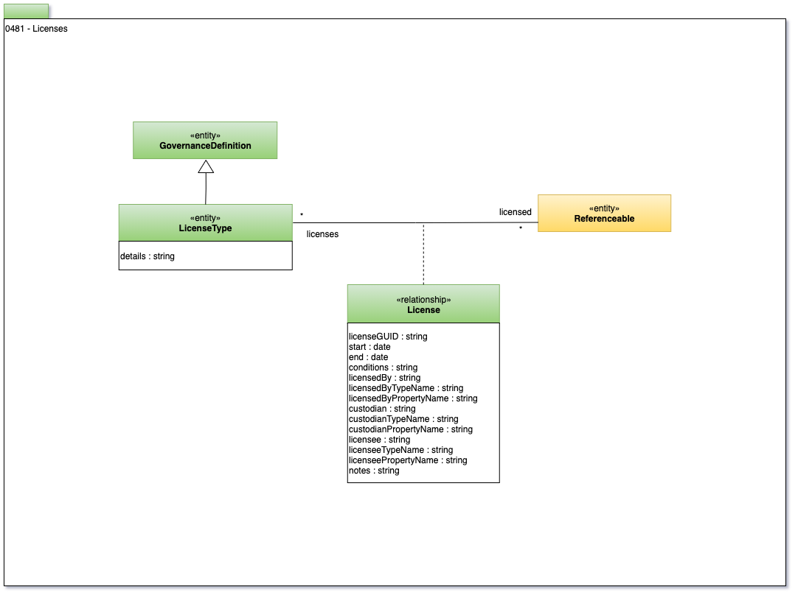

<!-- SPDX-License-Identifier: CC-BY-4.0 -->
<!-- Copyright Contributors to the Egeria project. -->

# 0481 Licenses

The data economy brings licensing to data and metadata.  Even open data typically has a license.

The license will define the permitted uses and other requirements for using the asset.

Details of a type of license are described in a **LicenseType**.
The asset that is licensed is identified with the **License** relationship.

