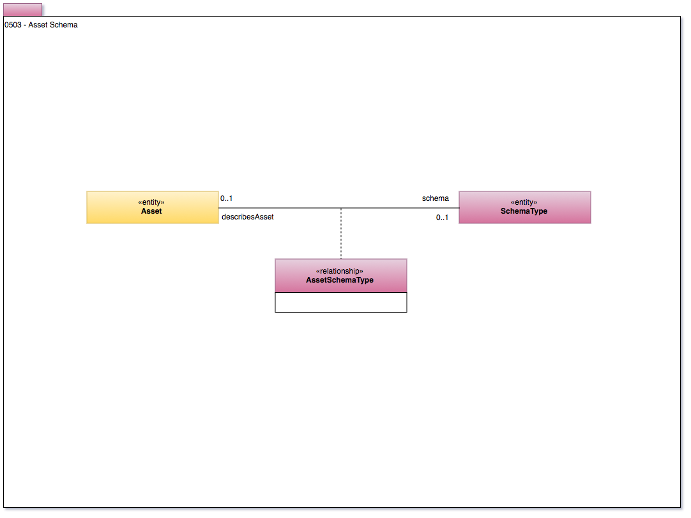

<!-- SPDX-License-Identifier: CC-BY-4.0 -->
<!-- Copyright Contributors to the ODPi Egeria project. -->

# 0503 Asset Schema

Model 0503 shows the relationship between an access and a
schema element.
A physical data store may be made up of a hierarchy of Assets.
Each of these Assets may point to the appropriate SchemaElements which are also typically organized in a hierarchy.
Thus we can work with both assets and schema at different
levels of granularity.

