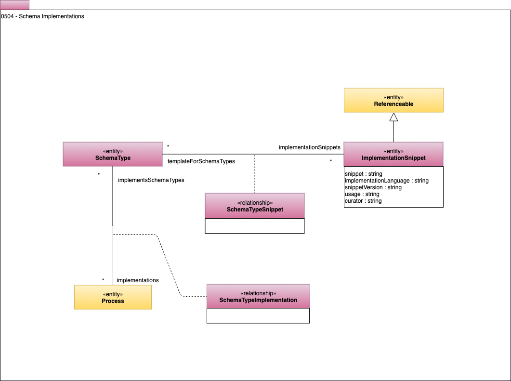

<!-- SPDX-License-Identifier: CC-BY-4.0 -->
<!-- Copyright Contributors to the Egeria project. -->

# 0504 Implementation Snippets

Developers can be aided in their work by having snippets of schema implementation that follow approved structures
and naming conventions that they can include in their APIs and data structures.
Model 0504 shows how these can be linked to a Schema Element.
The **ImplementationSnippet** is a [Referenceable](0010-Base-Model.md) which means
it can have a link to an external reference
(say a physical schema implementation in a source code repository).

