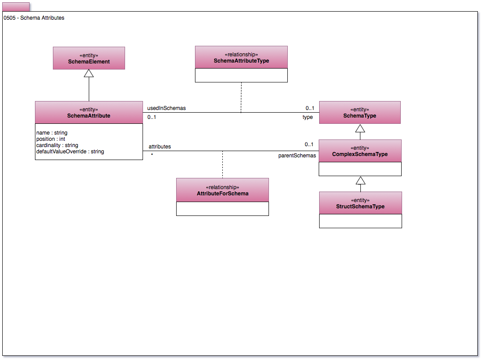

<!-- SPDX-License-Identifier: CC-BY-4.0 -->
<!-- Copyright Contributors to the Egeria project. -->

# 0505 Schema Attributes

Schema typically have a hierarchical structure.
Model 0505 provides for a structure of nested SchemaElements.
These structures are further specialized in area 5 for specific types of
[Asset](0010-Base-Model.md).

