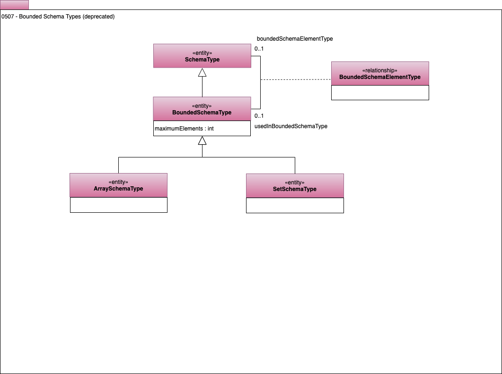

<!-- SPDX-License-Identifier: CC-BY-4.0 -->
<!-- Copyright Contributors to the ODPi Egeria project. -->

# 507 Bounded Schema Types

Bounded schema types define elements where there is a repeating structure.
Examples include sets and arrays.

Return to [Area 5](Area-5-models.md).

----
License: [CC BY 4.0](https://creativecommons.org/licenses/by/4.0/),
Copyright Contributors to the ODPi Egeria project.