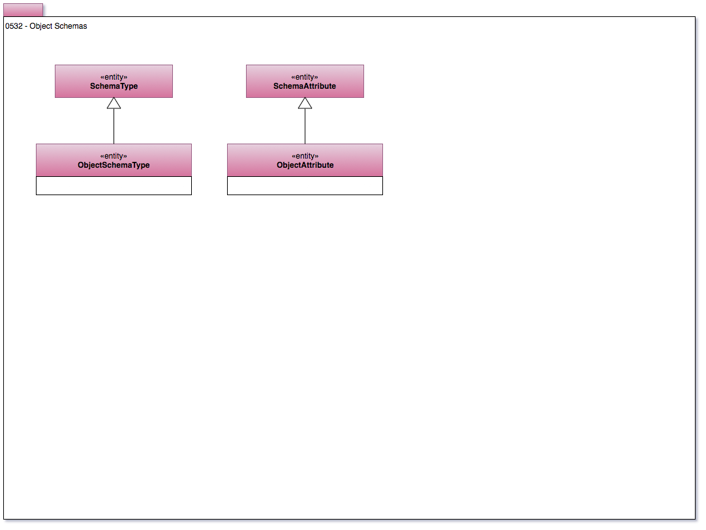

<!-- SPDX-License-Identifier: CC-BY-4.0 -->
<!-- Copyright Contributors to the Egeria project. -->

# 0532 Object Schemas

Model 0532 describes an object schema - such as the structure for a series of POJO Java objects.

