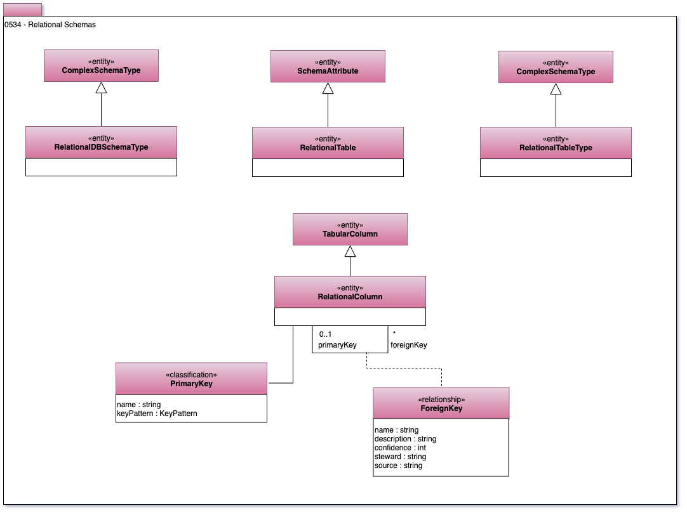

<!-- SPDX-License-Identifier: CC-BY-4.0 -->
<!-- Copyright Contributors to the ODPi Egeria project. -->

# 0534 Relational Schemas

Model 0534
describes the parts of a relational schema.
These are used in relational databases.
There are multiple tables and views defined within the relational schema.
The columns are within both the tables and views.

----
License: [CC BY 4.0](https://creativecommons.org/licenses/by/4.0/),
Copyright Contributors to the ODPi Egeria project.