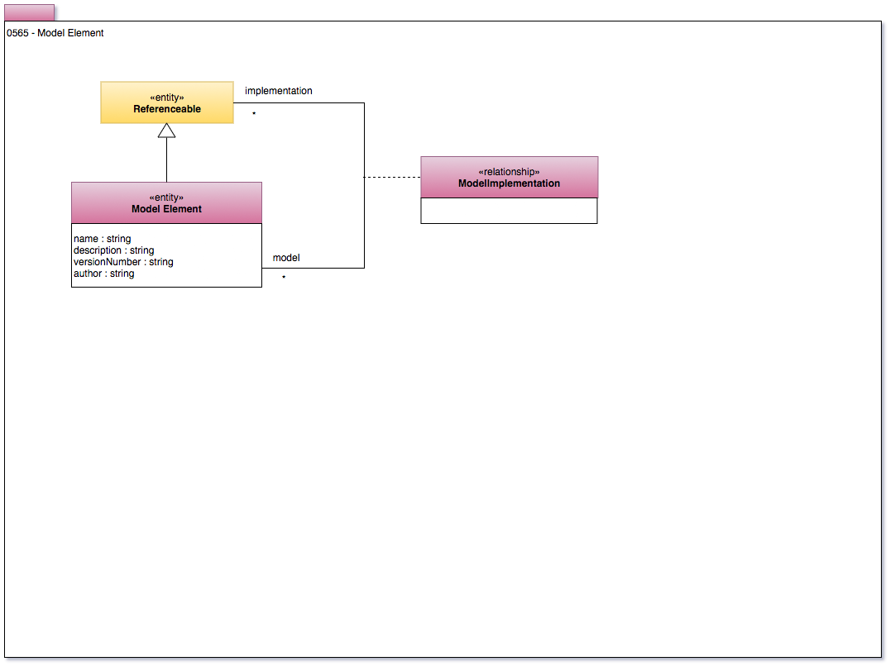

<!-- SPDX-License-Identifier: CC-BY-4.0 -->
<!-- Copyright Contributors to the ODPi Egeria project. -->

# 0565 Model Elements

Models are used during the development of schema and their
related software to provide templates and abstractions
of the implementation.
We add representations of models the the metadata repository
to help organize and explain data assets - particularly when
they are complex, or the schema is not available.

Model 0565 shows the definition of a model element ad its
relationship to the part of the IT landscape that it describes.
This is the base for many different types of models.
Currently we only have [solution blueprints](0580-Solution-Blueprints.md) defined. 

