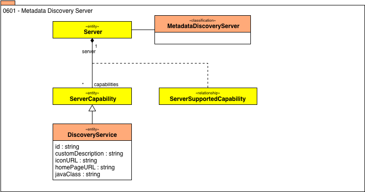

<!-- SPDX-License-Identifier: CC-BY-4.0 -->
<!-- Copyright Contributors to the Egeria project. -->

# 0601 Metadata Discovery Server

An open metadata discovery server uses the metadata repository to manage
its configuration and the configuration of the discovery services
that are deployed to it.

Each metadata discovery server is represented in the metadata
repository as a Server instance with a classification of
**MetadataDiscoveryServer**. 

Each type of discovery service is represented as an instance
of a **ServiceCapability** specialization called
**DiscoveryService**.  

These entities hold the configuration used by a metadata
discovery server.