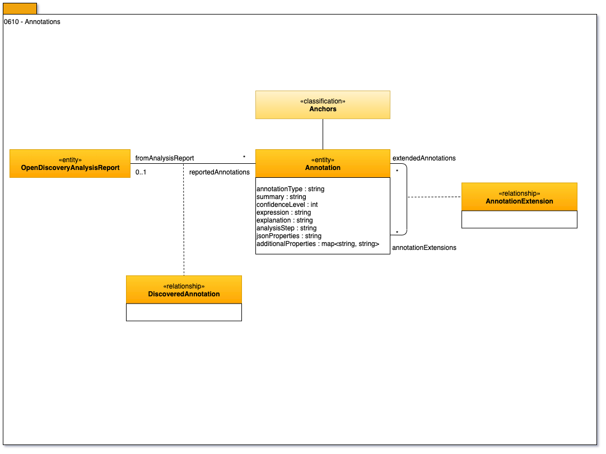

<!-- SPDX-License-Identifier: CC-BY-4.0 -->
<!-- Copyright Contributors to the ODPi Egeria project. -->

# 0610 Annotations

**Annotations** capture the discovered characteristics of an asset.
They are created by the analysis steps in the discovery service.
The attributes of the annotation capture the details of the discovery processing.
The sub-classes of Annotation capture specific details of the discovered metadata.
Each annotation is linked the the discovery analysis report it was generated from.
It also links to each asset that the annotation relates to.
Strings are used in many of the attributes to keep the model open
for discovery service developers and the tools that process them.

* **annotationType** - descriptive string that acts as an identifier for the specific annotation type.  This is a simple means to sub-type any one of the annotation subclasses.
* **summary** - a human readable string to describe the annotation.
* **confidence** - an indicator of the certainty that the annotation is correct.
* **expression** - this attribute is used to provide more detail on how the asset is related to the annotation.
* **explanation** - another description field to assist human analysts reviewing the discovery results.
* **analysisStep** - identifier of the step in the discovery service that detected the annotation.
* **jsonProperties** - the properties that were used to initiate the discovery service.

The types that follow provide more specialized annotations.

* **[0615 Schema Extraction](0615-Schema-Extraction.md)**
* **[0620 Profiling Annotation](0620-Profiling-Annotation.md)**
* **[0626 Semantic Discovery](0626-Semantic-Discovery.md)**
* **[0630 Relationship Discovery](0630-Relationship-Discovery.md)**
* **[0635 Classification Discovery](0635-Classification-Discovery.md)**
* **[0650 Measurements](0650-Measurements.md)**
* **[0660 Request for Action](0660-Request-for-Action.md)**
