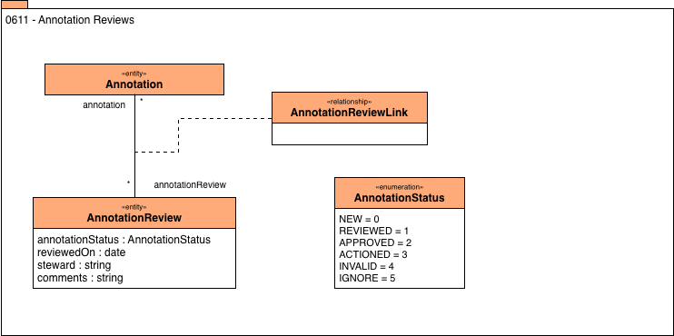

<!-- SPDX-License-Identifier: CC-BY-4.0 -->
<!-- Copyright Contributors to the Egeria project. -->

# Annotation Reviews

The annotations associated with an asset can be seen by
people and tools querying the associated asset, servers or
discovery service.
However, often the analysis within a discovery service can
only make recommendations based on the information within the asset.
Where annotations refer to information that is used for governance,
they need to be approved and converted into classifications,
or related metadata.
The Annotation review records how the discovered annotations
have been actioned in the metadata server and the steward that
approved it.

