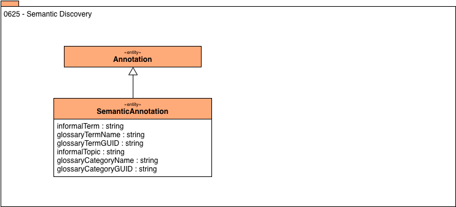

<!-- SPDX-License-Identifier: CC-BY-4.0 -->
<!-- Copyright Contributors to the Egeria project. -->

# 0626 Semantic Discovery

Semantic discovery is attempting to define the
meaning of the data values in the asset.
The result is a recommended glossary term
stored as an annotation.

