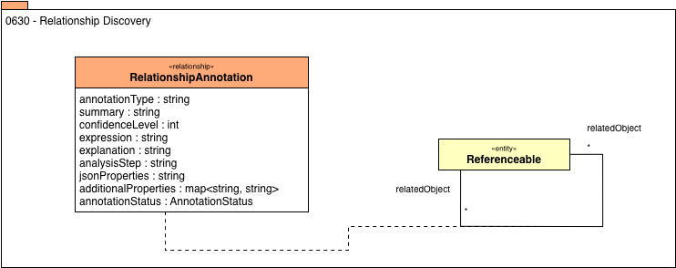

<!-- SPDX-License-Identifier: CC-BY-4.0 -->
<!-- Copyright Contributors to the ODPi Egeria project. -->

# 0630 Relationship Discovery

Relationship discovery identifies relationships between different assets (or parts of assets), such as 2 columns that have a foreign key relationship.

