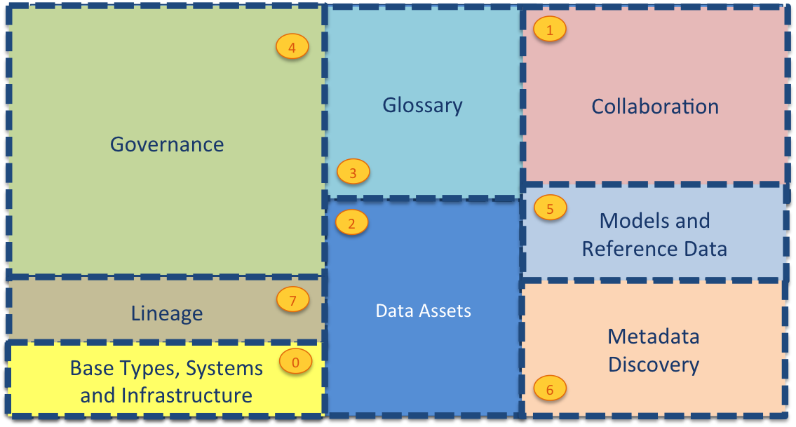
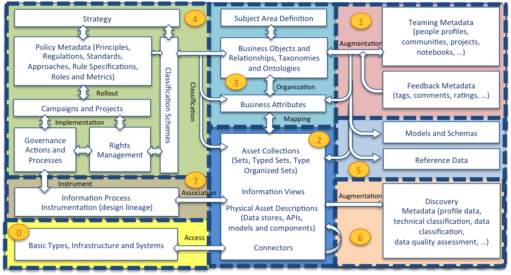

<!-- SPDX-License-Identifier: Apache-2.0 -->

# The open metadata type system

Knowledge about data is spread amongst many people and systems.
One of the roles of a metadata repository is to provide a place
where this knowledge can be collected and correlated in as automated fashion as possible.
To enable many different tools and processes to populate the metadata repository we need
agreement on what data should be stored and in what format (structures). 

Figure 1 shows the different areas of metadata that a metadata repository needs
to support a wide range of metadata management and governance tasks.

* Area 0 describes base types and infrastructure.  This includes types for Asset, DataSet, Infrastructure, Process, Referenceable, Server and Host.
* Area 1 collects information from people using the data assets.  It includes their use of the assets and their feedback.  It also manages crowd-sourced recommended enhancements to the metadata from other areas before it is approved and incorporated into the governance program.
* Area 2 describes the data assets.  These are the data sources, APIs, analytics models, transformation functions and rule implementations that store and manage data.  The definitions in Area 2 include connectivity information that is used by the open connector framework (and other tools) to get access to the data assets.
* Area 3 describes the glossary.  This is the definitions of terms and concepts and how they relate to one another.  Linking the concepts/terms defined in the glossary to the data assets in Area 2, defines the meaning of the data that is managed by the data assets.  This is a key relationship that helps people locate and understand the data assets they are working with.
* Area 4 defines how the data assets should be governed.  This is where the classifications, policies and rules are defined.
* Area 5 is where standards are established.  This includes data models, schema fragments and reference data that are used to assist developers and architects in using best practice data structures and valid values as they develop new capability around the data assets.
* Area 6 provides the additional information that automated metadata discovery engines have discovered about the data assets.  This includes profile information, quality scores and suggested classifications.
* Area 7 provides the structures for recording lineage.

Figure 2 provides more detail of the metadata structures in each area.

Within each area, the definitions are broken down into numbered packages to help identify
groups of related elements.
The numbering system relates to the area that the elements belong to.
For example, area 1 has models 0100-0199, area 2 has models 0200-299, etc.
Each area's sub-models are dispersed along its range, ensuring there is space to
insert additional models in the future.

These detailed models are shown below.

# Area 0 - Base concepts and infrastructure

* [Base Model]()
* [Linked Media Types]()
* [External Identifiers]()
* [Property Facets]()
* [Locations]()
* [Host and Platforms]()
* [Complex Hosts]()
* [Servers]()
* [Servers and Assets]()
* [Networks and Gateways]()
* [Cloud platforms and Services]()

# Area 1 - Collaboration

# Area 2 - Assets and Connectors

# Area 3 - Glossary

# Area 4 - Governance

# Area 5 - Standards

# Area 6 - Discovery

# Area 7 - Lineage