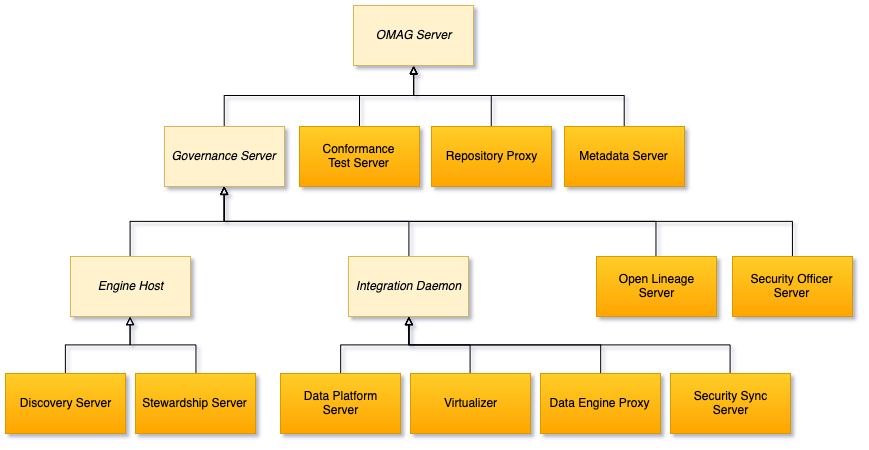
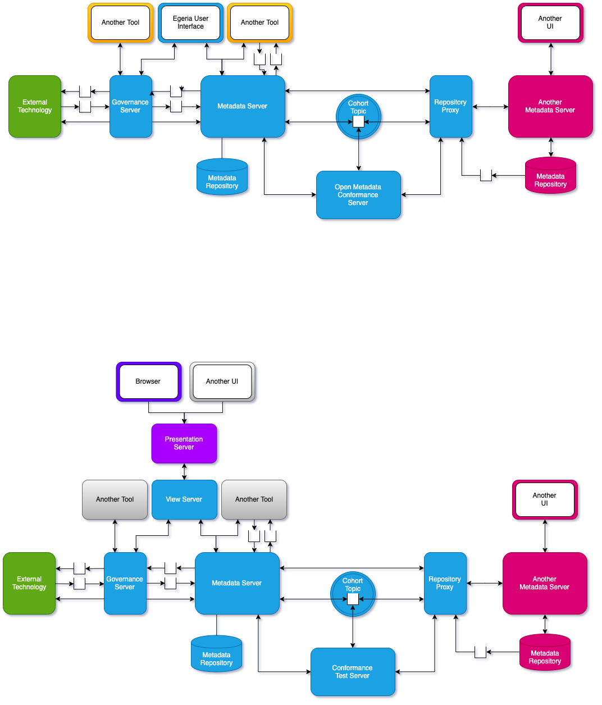

<!-- SPDX-License-Identifier: CC-BY-4.0 -->
<!-- Copyright Contributors to the ODPi Egeria project 2020. -->

# Egeria Planning Guide - How to deploy Egeria into your organization

The planning guide provides information to help you plan the deployment of Egeria
in your organization.

Egeria is highly flexible and configurable and so the first
piece of advice is to start small and simple and then expand as your experience
and understanding of your workloads grows.

## Platforms and Servers

Figure 1 shows the diagram from Egeria's home page showing Egeria exchanging metadata
between many types of tools distributed across different data centers and cloud
platforms.

> **Figure 1:** Egeria integrating different tools distributed over many locations

The green clouds represent each of the deployment location, the different technologies
are shown as grey boxes and Egeria itself is shown in blue and orange.

The blue rounded boxes are Egeria's Open Metadata and Governance (OMAG) Server Platform.
This platform is the heart of Egeria's implementation.  Typically you would expect to
have at least one OMAG Server Platform deployed in each location.  However,
when you are experimenting with Egeria, it is often sufficient to start with one
OMAG Server Platform and expend the number of platforms
as you expand the technologies being integrated.

The OMAG Server platform is capable of hosting
one or more Open Metadata and Governance (OMAG) Servers.  The OMAG Servers are the orange
circles in Figure 1.  They manage the connectors to third party technology as well as the
frameworks and intelligence that Egeria brings to distributed metadata management.

Different types of technology need different types of integration and so there are different
types of OMAG Servers.  Figure 2 shows the OMAG Servers implemented today.
This picture will expand as we embrace new types of technology.

> **Figure 2:** Types of OMAG Servers

The metadata server, repository proxy and conformance test server communicate with one another
via an open metadata repository cohort.  They exchange metadata through a low level, fine-grained
API supported by the Open Metadata Repository Services (OMRS).
The governance servers connect to the metadata server.

Figure 3 shows how the servers connect together.

> **Figure 3:** How the OMAG Servers interact

When you are designing the deployment of Egeria, the first step is to identify the technology
that you want to integrate.  This will determine which type of OMAG Servers you need.
Once the OMAG Servers are selected, they are assembled and connected together as shown in Figure 3.

The text above is a very high level overview of the planning process.
More detail will be added to this guide as time permits.

## Deployment checklist

This is a checklist of planning tasks for the deployment of your OMAG Server Platforms
and OMAG Servers.

* Use an encrypted configuration document store for your platforms since
  configuration documents can have certificates and passwords in them.

* Implement the metadata security connectors for your organization to
  ensure only authorized users access metadata.
  
* Choose and configure the audit log destinations for your OMAG servers.

* Ensure you have at least one Egeria metadata server in each of your
  open metadata and governance cohorts.
  
* Assign a separate user id for each of your servers and ensure they are
  defined in your user directory and are authorized users according to the
  metadata security connectors.
  
* Consider where you need to have multiple versions of the same server running to give continuous
  availability.

----
License: [CC BY 4.0](https://creativecommons.org/licenses/by/4.0/),
Copyright Contributors to the ODPi Egeria project.