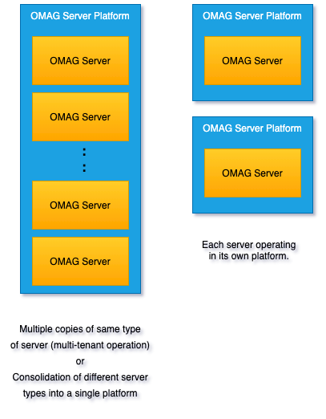
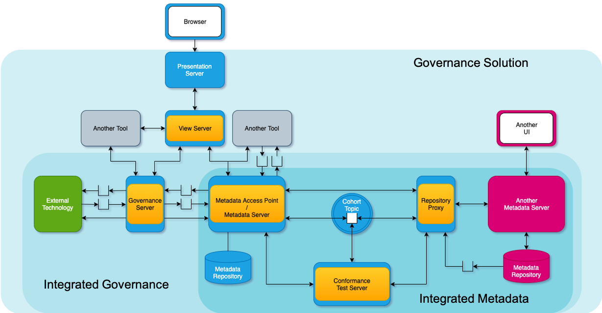

<!-- SPDX-License-Identifier: CC-BY-4.0 -->
<!-- Copyright Contributors to the ODPi Egeria project 2020. -->

# Egeria Planning Guide - How to deploy Egeria into your organization

The planning guide provides information to help you plan the deployment of Egeria
in your organization.

Egeria is highly flexible and configurable and so the first
piece of advice is to start small and simple and then expand as your experience
and understanding of your workloads grows.

## Platforms and Servers

Figure 1 shows the diagram from Egeria's home page showing Egeria exchanging metadata
between many types of tools distributed across different data centers and cloud
platforms.

> **Figure 1:** Egeria integrating different tools distributed over many locations

The green clouds represent each of the deployment locations.
The different technologies
are shown as grey boxes and Egeria itself is shown in blue and orange.

The blue rounded boxes are Egeria's Open Metadata and Governance (OMAG) Server Platform.
This platform is the heart of Egeria's implementation.  Typically you would expect to
have at least one OMAG Server Platform deployed in each location.  However,
when you are experimenting with Egeria, it is often sufficient to start with one
OMAG Server Platform and expand the number of platforms
as you expand the technologies being integrated.

The OMAG Server Platform is capable of hosting
one or more Open Metadata and Governance (OMAG) Servers.  The OMAG Servers are the orange
circles in Figure 1.  They manage the connectors to third party technology as well as the
frameworks and intelligence that Egeria brings to distributed metadata management.

It is a simple command to move an OMAG Server from one platform instance to another.
This means you can start experimenting with a single platform and then add more as
your deployment grows.  The platform can also run as a node in container technologies
such as Docker and Kubernetes.

> **Figure 2:** OMAG Server deployment choices

Different types of technology need different types of integration and Egeria has OMAG Servers to match.
Each type of OMAG Server is focused on the integration of a specific type of tool, engine or platform.
Figure 3 shows the OMAG Servers implemented today and how they are classified.
This picture will expand as Egeria embraces new types of technology.

> **Figure 3:** Types of OMAG Servers

The way to understand the diagram is that the arrows should be read as **IS A**.  For example,
the **Repository Proxy IS A Cohort Member** and the **Cohort Member IS A OMAG Server**.
This means that everything documented about a particular type of server is also true for
all server types that point to it through the **IS A** arrow, all of the way down the hierarchy.

Object-oriented software engineers would know of this type of relationship as behavior inheritance.

The **cohort members** communicate with one another
via an [open metadata repository cohort](../../../open-metadata-implementation/repository-services/docs/open-metadata-repository-cohort.md).
This means that they exchange metadata through a low level, fine-grained
API supported by the Open Metadata Repository Services (OMRS).
[Click here to see details of the protocol](../../../open-metadata-implementation/repository-services/docs/metadata-meta-model.md).

The Open Metadata Access Services (OMASs) are built on top of the repository services.
They live in the metadata access point/metadata servers.
They offer more course-grained interfaces, specialized for particular types of technology.
[Click here to see the full list](../../../open-metadata-implementation/access-services).

The governance servers are again specialized for particular types of
metadata integration or additional governance activity.
They connect to a metadata access point / metadata server.

Finally the view servers support the services for the solution user interfaces.  They also connect to a
metadata access point / metadata server.

Figure 4 shows how the servers connect together.

> **Figure 4:** How the OMAG Servers interact

Figure 5 shows that the servers' integration can be viewed as a series of nested spheres.
The inner sphere involves the cohort members and provides metadata exchange between metadata repositories
(and conformance test the integrations).  The next level out adds the governance servers to
automate the exchange of metadata between the metadata repositories and third party tools, engines and
platforms.  Finally, adding the view server and user interfaces delivers a governance solution to an
organization.

> **Figure 5:** Spheres of interaction between OMAG Servers

This architecture means that you can incrementally add function to your deployment.
Here is a suggested approach:

* Start with creating an Egeria graph metadata server.  This will provide a metadata repository
  that can store any type of open metadata.

* Decide on a name for an open metadata repository cohort and add configure your graph metadata repository to join it.

* If you want to have other third party metadata repositories that you want to share metadata with,
  configure repository proxies for each including registering them to the same cohort as the metadata server.
 
* If you then want to add in metadata synchronization with other types of technology beyond metadata repositories,
  work out which integration daemons you need and configure them to connect to the metadata server.
  Make sure the appropriate access services for these integration daemons are enabled in the metadata server.

* If you want to use the discovery server or stewardship server then these can be connected to the
  metadata server via the Discovery Engine and Stewardship Action access services respectively.
  
* Finally if you want to deploy the user interfaces, make sure you have at least one view server for the
  presentation server that hosts the UI application.

Working through this exercise gives you an understanding of the Egeria technology that you need for
your deployment and how it connects together.

Follow [this link](../../../open-metadata-implementation/admin-services/docs/concepts)
to learn more about the different types of servers.
The [Administration Guide](../../../open-metadata-implementation/admin-services/docs/user)
describes how to configure both the OMAG Server Platform and OMAG Servers described above.

## Building connectors

If you discover that there is a third party technology that is not currently supported 
by Egeria then you need to build a connector to translate between the APIs and events of that
technology and the open metadata APIs and event.  This is described in the
[Developer Guide](../developer-guide).

## Thinking about the scope of the metadata integration

Another useful planning exercise is to identify the community
of users and the tools that they use that need to share metadata.
This gives you a view of the technology that needs to be integrated.
If each community is fairly self-contained with their own tools deployment
then you may want to consider deploying an OMAG Server platform for this community and
deploying the servers they need onto it.  This means they can control
their access to open metadata along with the delivery of open metadata to the rest of the organization.

More importantly, it helps with the definition of the organization's
[governance zones](../../../open-metadata-implementation/access-services/docs/concepts/governance-zones).

## Deployment checklist

This is a checklist of planning tasks for the deployment of your OMAG Server Platforms
and OMAG Servers.

* Set up unique certificates for your OMAG Server Platforms
  [more information](../../../open-metadata-implementation/admin-services/docs/user/omag-server-platform-transport-level-security.md).

* Use an encrypted configuration document store for your platforms since
  configuration documents can have certificates and passwords in them
  [more information](../../../open-metadata-implementation/admin-services/docs/user/configuring-the-configuration-document-store.md).

* Implement the metadata security connectors for your organization to
  ensure only authorized users access metadata
  [more information](../../../open-metadata-implementation/common-services/metadata-security).
  
* Choose and configure the audit log destinations for your OMAG servers
  [more information](../../../open-metadata-implementation/admin-services/docs/user/configuring-the-audit-log.md).

* Ensure you have at least one Egeria metadata server in each of your
  open metadata repository cohorts
  [more information](../../../open-metadata-implementation/admin-services/docs/user/configuring-the-repository-services.md).
  
* Assign a separate user id for each of your servers and ensure they are
  defined in your user directory and are authorized users according to the
  metadata security connectors.
  [more information](../../../open-metadata-implementation/admin-services/docs/user/configuring-omag-server-basic-properties.md)
  
* Consider where you need to have multiple versions of the same server running to give continuous
  availability
  [more information](../../../open-metadata-implementation/admin-services/docs/user).
  
* Plan your use of the event bus - which technology to use (Apache Kafka is the default)
  and the names of the topics that your OMAG Servers will use
  [more information](../../../open-metadata-implementation/admin-services/docs/concepts/event-bus.md).
  
* Design the governance zones that you want to use to control the visibility of assets to
  different communities of users - or processes
  [more information](../../../open-metadata-implementation/access-services/docs/concepts/governance-zones).

## More detail to follow ...

The text above is a very high level overview of the planning process.
More detail will be added to this guide as time permits.

----
Return to the [Home Page](../../../index.md)

----
License: [CC BY 4.0](https://creativecommons.org/licenses/by/4.0/),
Copyright Contributors to the ODPi Egeria project.