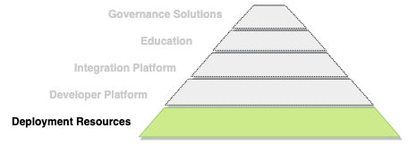
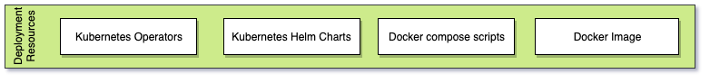

<!-- SPDX-License-Identifier: CC-BY-4.0 -->
<!-- Copyright Contributors to the ODPi Egeria project 2020. -->

# Deployment Resources Functional Detail

Egeria's **Deployment Resources** aims to simplify the process of
deploying the OMAG Server Platform and its connectors into
an operational environment.  They are outlined in
Figure 1.

> **Figure 1:** Different types of deployment resources offered by Egeria

The **Egeria Docker Image** is built daily and pushed to
[DockerHub](https://hub.docker.com/r/odpi/egeria).  It contains an OMAG Server Platform.
You can down load it an use it in your own container environments.

The **Kubernetes Helm Charts** and **Docker compose scripts** make use of the
docker image to create a rich Egeria deployment used in the hands on labs.
Their they are located in the [open-metadata-deployment](../../../open-metadata-resources/open-metadata-deployment) module
and their use is described in [the setting up instructions](../../../open-metadata-resources/open-metadata-labs) of the hands on labs.

The **Kubernetes Operators** are in development.  They will provide an easy way to control an
Egeria deployment running on Kubernetes. 

----
Return to [Status Overview](.)

----
License: [CC BY 4.0](https://creativecommons.org/licenses/by/4.0/),
Copyright Contributors to the ODPi Egeria project.