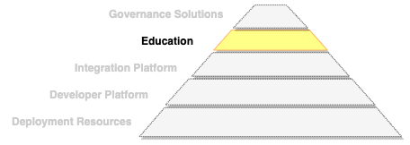
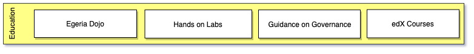

<!-- SPDX-License-Identifier: CC-BY-4.0 -->
<!-- Copyright Contributors to the ODPi Egeria project 2020. -->

# Education Functional Detail

Egeria's **Education** aims to broaden the knowledge of people who need to
work with digital resources about metadata, governance practices and the
use of Egeria.  Since that are many types of professionals involved
with different skill levels, there are different choices that are shown in
Figure 1.

> **Figure 1:** Different types of education offered by Egeria

The **Egeria Dojo** is a deep dive into the Egeria code and community.
It is aimed at individuals who wish to become contributors. 
[See more...](../../../open-metadata-resources/open-metadata-tutorials/egeria-dojo)

The **Hands On Labs** provide practical experiences in running the Egeria code and
using the different services.  It is based around the
[Coco Pharmaceuticals](https://opengovernance.odpi.org/coco-pharmaceuticals/) use case and is organized by
persona so you can target your learning
to your interests.
[See more...](../../../open-metadata-resources/open-metadata-labs).

The **Guidance on Governance** provides governance best practices and
training using the same Coco Pharmaceuticals use cases as the hands on labs.
They aim to guide a team that is setting up or revising their governance program
through common governance tasks.
They link to the [Egeria code samples](../../../open-metadata-resources/open-metadata-samples)
and hands on labs to show how these best practices could be implemented using Egeria.

The **edX courses** are a new idea to provide a full curriculum and certification
for governance professionals and architects.  It is in the early phases of design.

----
Return to [Status Overview](.)

----
License: [CC BY 4.0](https://creativecommons.org/licenses/by/4.0/),
Copyright Contributors to the ODPi Egeria project.