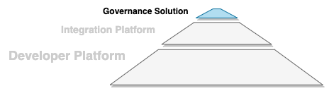

<!-- SPDX-License-Identifier: CC-BY-4.0 -->
<!-- Copyright Contributors to the ODPi Egeria project 2020. -->

# Governance Solutions Functional Detail

Figure 1 summarizes the function that belongs in Egeria's
**Governance Solutions**.

> **Figure 1:** Key capabilities in Egeria's Governance Solution

The implementation of a governance solution is focused mainly on the extension of
the Egeria UI to support additional roles and functions.  They make use of
the services provided by the [Developer Platform](developer-platform-functional-detail.md)
and may exploit additional content, utilities and connector implementations from the
integration platform.

----
Return to [Status Overview](.)

----
License: [CC BY 4.0](https://creativecommons.org/licenses/by/4.0/),
Copyright Contributors to the ODPi Egeria project.