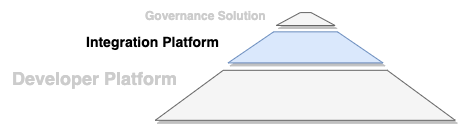

<!-- SPDX-License-Identifier: CC-BY-4.0 -->
<!-- Copyright Contributors to the ODPi Egeria project 2020. -->

# Integration Platform Functional Detail

Figure 1 summarizes the function that belongs in Egeria's
**Integration Platform**.

> **Figure 1:** Key capabilities in Egeria's Integration Platform

## Egeria Integration User Interface

Server and platform configuration; ecosystem monitoring; type explorer and repository explorer.

## Utilities and converters
Support for different standard formats to load industry standard definitions, models, glossaries,
and other content packs built on industry standard definitions, models,
glossaries and other content packs.  Examples include JSON-LD, OWL/RDF, XML, ...

## Pre-canned Connectors to third party technologies
Popular metadata repositories, databases, data formats and platforms;
data movement engines, data virtualization engines, dev ops tools,
analytics/AI tools, data catalogs, MDM and user directories, CMDBs, SDLC tools, ...

## Conformance Test Suite
Supports the testing of third party connectors.  Each type of connector or service is supported
by its own test workbench.  See [Conformance Test Suite Documentation](../../../open-metadata-conformance-suite)
for more details.

----
Return to [Status Overview](.)

----
License: [CC BY 4.0](https://creativecommons.org/licenses/by/4.0/),
Copyright Contributors to the ODPi Egeria project.