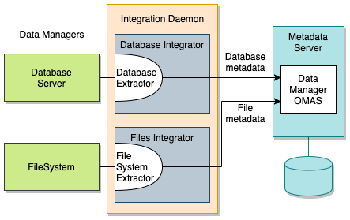
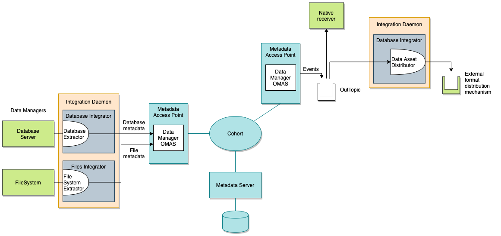
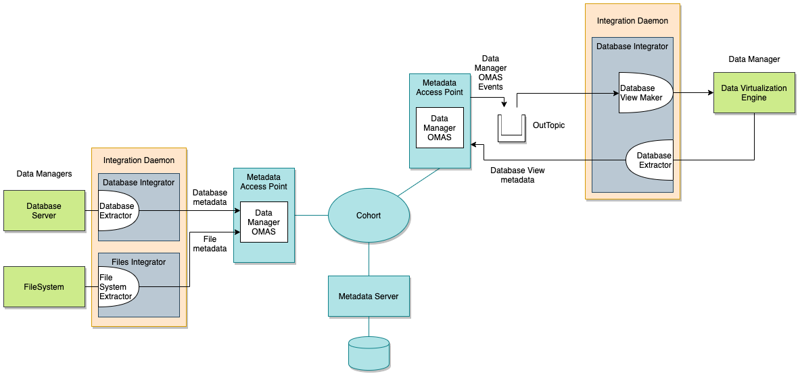

<!-- SPDX-License-Identifier: CC-BY-4.0 -->
<!-- Copyright Contributors to the ODPi Egeria project 2020. -->

# Data manager integration

A data manager is a technology that manages collections of data.  Examples include
database management systems, content management systems, document management systems and file management systems.

The data manager typically maintains a catalog of the data it is managing and the purpose of the
data manager integration is to bring this metadata into the open metadata ecosystem.
Once it is in the open metadata ecosystem, the metadata can be distributed and enhanced with classifications
and relationships to glossary terms, tags and reference data sets to help people find these assets and to
enable governance engines to manage them.

In this solution we are going to cover:

* automatic cataloguing of data assets and their properties
* automatic distribution of information about data assets to interested parties
* automatic configuration of data managers based on the data assets in other data managers

Figure 1 shows the set up to extract metadata from one or more data managers.
It takes a data manager integration connector to interface with a specific data manager.  This is
running in the [Database Integrator Open Metadata Integration Service (OMIS)](../../../../open-metadata-implementation/integration-services/database-integrator)
hosted in an [Integration Daemon](../../../../open-metadata-implementation/admin-services/docs/concepts/integration-daemon.md).

> **Figure 1:** Set up for metadata extraction from data managers

> **Figure 2:** Set up for distribution of metadata from data managers

> **Figure 3:** Set up for distribution of metadata from data managers

----
* Return to the [Egeria solutions](..)
----
License: [CC BY 4.0](https://creativecommons.org/licenses/by/4.0/),
Copyright Contributors to the ODPi Egeria project.