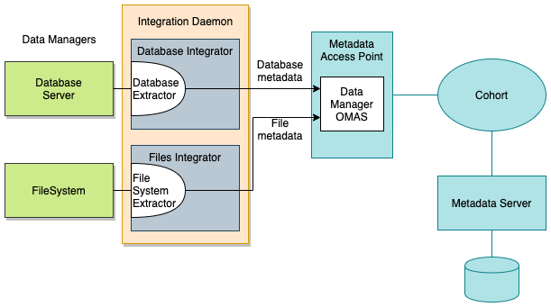

<!-- SPDX-License-Identifier: CC-BY-4.0 -->
<!-- Copyright Contributors to the ODPi Egeria project 2020. -->

# Data manager integration

A data manager is a technology that manages collections of data.  Examples include
database management systems, document/content managers,
event brokers, API gateways and file systems.

The data manager typically maintains a catalog of the data it is managing and the purpose of the
data manager integration is to bring this metadata into the open metadata ecosystem.
Once it is in the open metadata ecosystem, the metadata can be distributed and enhanced with classifications
and relationships to glossary terms, tags and reference data sets to help people find these assets and to
enable governance engines to manage them.

In this solution we are going to cover:

* automatic cataloguing of data assets and their properties
* automatic distribution of information about data assets to interested parties
* automatic configuration of data managers based on the data assets in other data managers

Figure 1 shows the set up to extract metadata from one or more data managers and store it in a metadata server.
It takes an [integration connector](../../../../open-metadata-implementation/governance-servers/integration-daemon-services/docs/integration-connector.md)
to interface with a specific data manager.  This is
running in an appropriate [Open Metadata Integration Service (OMIS)](../../../../open-metadata-implementation/integration-services)
hosted in an [Integration Daemon](../../../../open-metadata-implementation/admin-services/docs/concepts/integration-daemon.md).

The OMIS to use for different types of technology is shown in the table below.

| Technology | Examples | OMIS   |
| :--------- | :------- | :--------- |
| Database | PostgreSQL | [Database Integrator OMIS](../../../../open-metadata-implementation/integration-services/database-integrator) |
| Filesystems | local disk storage | [Files Integrator OMIS](../../../../open-metadata-implementation/integration-services/files-integrator) |
| Document/Content Managers | Photo Library | [Files Integrator OMIS](../../../../open-metadata-implementation/integration-services/files-integrator) |
| Event Brokers | Apache Kafka | [Topic Integrator OMIS](../../../../open-metadata-implementation/integration-services/topic-integrator) |
| API Managers | Swagger Site | [API Integrator OMIS](../../../../open-metadata-implementation/integration-services/api-integrator) |

 

In Figure 1, integration connector `Database Extractor` is monitoring for schema changes in the Database Server
and cataloguing them in open metadata through the Database Integrator OMIS.  The Database Integrator OMIS
calls the [Data Manager OMAS](../../../../open-metadata-implementation/access-services/data-manager) which stores the open metadata in its local repository.

Similarly, 
* Integration connector `File System Extractor` is monitoring for changes to files on the file system and
cataloguing them in open metadata through the Files Integrator OMIS and the Data Manager OMAS.
* Integration connector `Document Extractor` is monitoring for changes to documents in a content manager and
cataloguing them in open metadata through the Files Integrator OMIS and the Data Manager OMAS.
* Integration connector `Topic Extractor` is monitoring for changes to files on the file system and
cataloguing them in open metadata through the Topic Integrator OMIS and the Data Manager OMAS.
* Integration connector `API Extractor` is monitoring for changes to deployed APIs in a platform or API gateway and
cataloguing them in open metadata through the API Integrator OMIS and the Data Manager OMAS.

> **Figure 1:** Set up for metadata extraction from data managers and stored in a local repository

Figure 2 shows a similar set up except that the resulting metadata is being stored in a remote metadata
repository connected via a [cohort](../../../../open-metadata-implementation/admin-services/docs/concepts/cohort-member.md).

> **Figure 2:** Set up for metadata extraction from data managers and stored in a remote repository

Figure 3 adds a new integration connector (called `Data Asset Distributor`) that listens for events
from the Data Manager OMAS about new or updated data assets being catalogued in
any repository in the cohort.  This `Data Asset Distributor` can distribute this information to other processes.

Note, `Data Asset Distributor` could be deployed in the same integration daemon as `Database Extractor`
and `File System Extractor`.  It is show in a different integration daemon for the sake of clarity in the diagram.

> **Figure 3:** Set up for distribution of metadata from data managers

Figure 4 shows two integration connectors that are maintaining database views in a Data Virtualization Engine.
`Database View Maker` is listening for new databases and schema changes and automatically configuring views over
these data sources and the second copy of `Database Extractor` is detecting the schema changes in the Data
Data Virtualization Engine and is cataloguing them in open metadata.

It is possible for `Database View Maker` to create the metadata for the views that it is creating.
However the approach shown in Figure 4 has the advantage that all views created in the Data Virtualization Engine
are catalogued rather than just the ones created by `Database View Maker`.

> **Figure 4:** Set up for distribution of metadata from data managers

----

* Link to the [Connector Catalog](../../connector-catalog) to understand the integration connectors supplied by Egeria
* Return to the [Egeria solutions](..) descriptions

----
License: [CC BY 4.0](https://creativecommons.org/licenses/by/4.0/),
Copyright Contributors to the ODPi Egeria project.