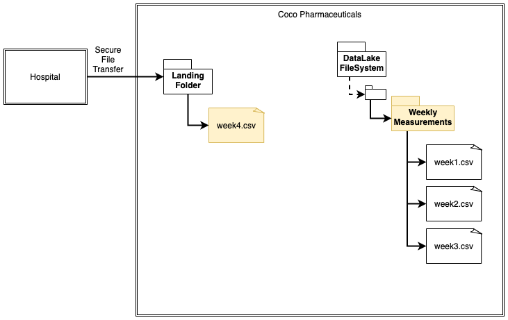
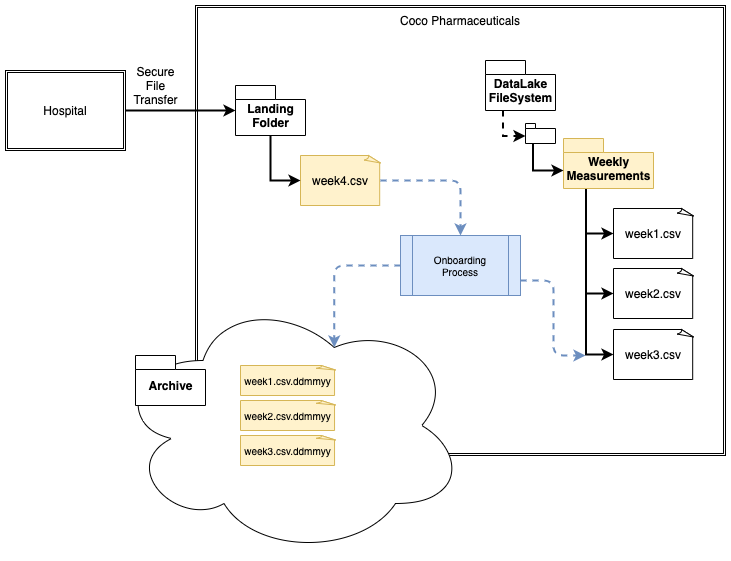
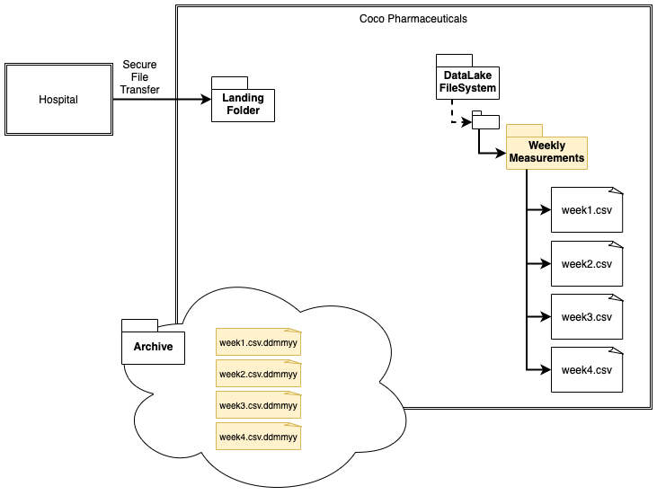
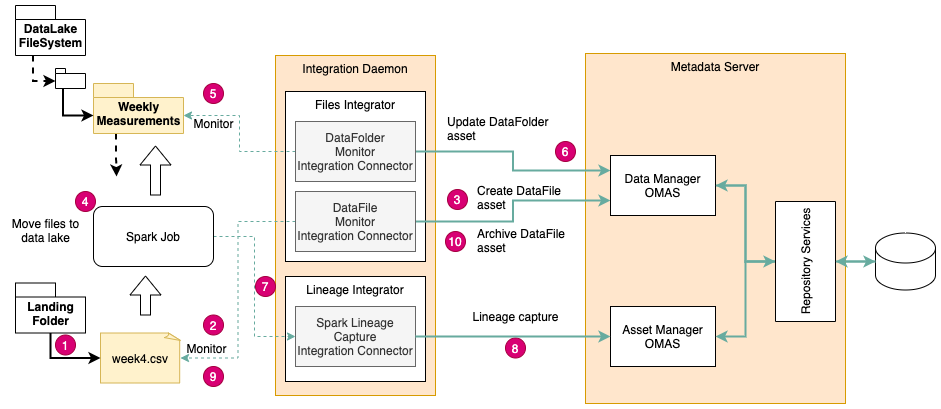
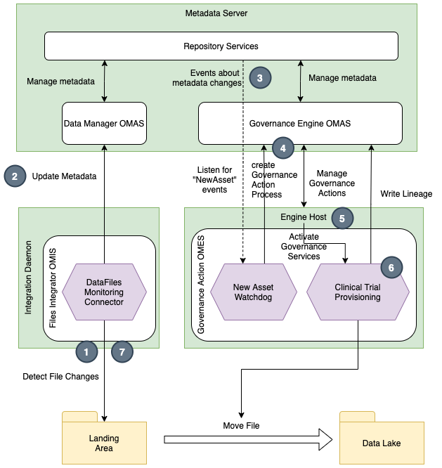
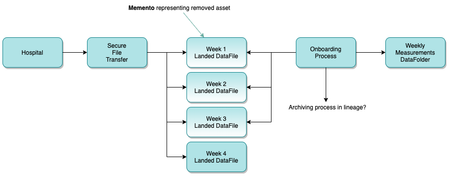

<!-- SPDX-License-Identifier: CC-BY-4.0 -->
<!-- Copyright Contributors to the Egeria project. -->

# File Lineage Solutions

[Lineage](../../lineage) shows how data flows from its origins to its various destinations.
Files are often managed through a variety of ad hoc processes.
They are often copied multiple times or moved from one location to another.
This means that organizations need a variety of approaches to properly record lineage for files.

## The scenario

Consider this example.  Figure 1 shows the `week4.csv` file in the landing folder.
It was transferred from an external party and has been automatically catalogued so it can be part of the lineage
flow that identifies the source of the file.

> **Figure 1:** Receipt of file in a landing folder

Then in figure 2, an onboarding process removes the file from the landing area and puts one copy in a folder in
the data lake and another copy in an archive file.

> **Figure 2:** Movement of file from the landing folder to the data lake and an archive

Once the onboarding process completes, the landing folder is empty as shown in figure 3.
What happens to the asset that catalogued the file in the landing area?

> **Figure 3:** Ready for the next file from the hospital

What follows are two possible solutions for managing lineage for files being ingested in to a data lake.

## Metadata capture for an onboarding process that publishes lineage

Figure 1 shows an example of using the 
[integration daemon](../../../../open-metadata-implementation/admin-services/docs/concepts/integration-daemon.md)
to automatically capture lineage from a
spark job onboarding the files in to a data lake. The spark job operates independently of Egeria
but is publishing lineage through the Open Lineage API.

There is a [Lineage Integrator OMIS](../../../../open-metadata-implementation/integration-services/lineage-integrator)
integration connector capturing this lineage from the spark job, correlating this information
with the Assets being created by the 
[integration connectors](../../../../open-metadata-implementation/governance-servers/integration-daemon-services/docs/integration-connector.md)
running in the
[Files Integrator OMIS](../../../../open-metadata-implementation/integration-services/files-integrator).

> **Figure 4:** Automatic lineage capture from an external process

1. A new file is added to the landing folder
2. New file detected by Data File Monitor Integration Connector
3. Asset catalogued for the new file asset
4. Spark job detects the file in the landing folder and runs, moving the file to the data lake (and archive folder)
5. The new file in the data lake folder is detected by the Data Folder Monitor Integration Connector
6. The Data Folder asset is updated to reflect the new data
7. Meanwhile the spark job is publishing lineage metadata which is picked up by the Spark Lineage Capture
   Integration Connector
8. The Spark Lineage Capture Integration Connector correlates the lineage metadata from spark with the
   assets in the metadata catalog and records the lineage.

## Metadata capture through a provisioning governance action service

Figure 5 is an alternative design where the onboarding process is implemented in a
[Provisioning Governance Action Service](../../../../open-metadata-implementation/frameworks/governance-action-framework/docs/provisioning-governance-service.md).
running in an
[Engine Host](../../../../open-metadata-implementation/admin-services/docs/concepts/engine-host.md) server.

The provisioning governance action service records lineage directly in the metadata server as part of its processing.
This means the Lineage Capture Integration Connector is not needed.

> **Figure 5:** Automatic lineage capture from a provisioning governance action service

1. New file detected by Data File Monitor Integration Connector
2. File asset created in metadata server
3. New Asset event passed to Watchdog Governance Service
4. New Governance Action created that results in notification to Engine Host
5. Engine Host claims Governance Action and activates Provisioning Governance Service
6. Provisioning Governance Service moves file and writes lineage
7. Deleted file is detected and Asset archived 

## Resulting Lineage graphs

Figure 6 shows the resulting lineage graph for the onboarding process.  It represents the
lineage status as the point shown in figure 1.

> **Figure 6:** Lineage at the point shown in figure 1

An organization may choose to the show the archive folder in lineage or it may not.
It depends if it is useful to the catalog users.  This is therefore shown as optional.

The files:
* Week 1 Landed DataFile
* Week 2 Landed DataFile
* Week 3 Landed DataFile

are show in a slightly different color.  Ths is to indicate that they have been classified with
the [Memento Classification](../../open-metadata-types/0010-Base-Model.md) to indicate that the
described real world resource no longer exists and the asset is being kept to maintain the lineage graph.

Figure 7 shows how the memento classification is stored in open metadata.

> **Figure 7:** Memento representation

----
* Return to [Solutions](..)

----
License: [CC BY 4.0](https://creativecommons.org/licenses/by/4.0/),
Copyright Contributors to the Egeria project.