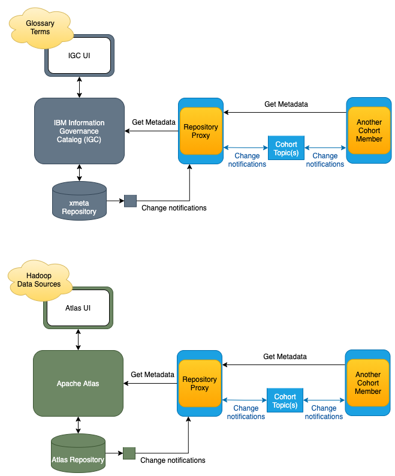

<!-- SPDX-License-Identifier: CC-BY-4.0 -->
<!-- Copyright Contributors to the ODPi Egeria project 2020. -->

# Metadata Server Exchange

The metadata server exchange solution describes how third party metadata servers can exchange metadata through
an **Open Metadata Repository Cohort** or **Cohort** for short.

A cohort uses a peer-to-peer exchange protocol.
Servers that implement the protocol's open metadata APIs and event exchange sequences can
become a member of one or more cohorts.  Each member of a cohort can send
notifications about updates to its metadata to the other members of the cohort
as well as query/update metadata from all of the member repositories.

Since the cohort protocols are open, they can be implemented by any technology.  However in this solution
we are going to focus on integrating third party metadata servers that **do not** implement the protocol.

## Introducing the Repository Proxy

Third party metadata servers that do not directly support any of the open metadata APIs and protocols
need an adapter to convert their events and APIs into open metadata events and APIs
as well as manage the protocol event sequencing.

To make this easy, Egeria provides a special
[OMAG Server](../../../../open-metadata-implementation/admin-services/docs/concepts/omag-server.md) called the
[Repository Proxy](../../../../open-metadata-implementation/admin-services/docs/concepts/repository-proxy.md)
that is an adapter for third party metadata servers.
Inside the repository proxy are plug points for two repository connectors:

  * The **OMRS Repository Connector** - translates calls to the OMRS Repository REST API to calls to the third party
    metadata server's API.
  * The **OMRS Event Mapper** - translates events from the third party metadata server to open metadata events. 
 
The repository proxy represents the third party metadata server in the cohort and calls the connectors as required.
You need one repository proxy for each third party metadata server that you want to be in the solution.

Figure 1 shows the repository proxy in action:

> **Figure 1:** showing a repository proxy acting as an adapter for a third party metadata server

You can create your own implementation of the repository connectors for your favorite metadata server
using [these instructions](https://wiki.lfaidata.foundation/display/EG/Implement+an+Open+Metadata+Repository+Connector).
Alternatively Egeria provides repository connector implementations for two third party metadata servers:

  * [IBM Information Governance Catalog (IGC)](https://github.com/odpi/egeria-connector-ibm-information-server)
  * [Apache Atlas](https://github.com/odpi/egeria-connector-hadoop-ecosystem)

We will use these implementations to illustrate the metadata server exchange solution.
We are also assuming that in this example, glossary terms are being maintained in IGC and the organization
wants to connect these terms to the Hadoop data sources described in Apache Atlas.

## Working with read-only third party metadata repository connectors

Most third party metadata servers do not support the storing of metadata from other metadata servers.
The sticking point is typically that it can not store information about
[where the metadata came from](../../metadata-provenance) and it can not guarantee that metadata from
another metadata server is not updatable through its APIs and user interfaces.
There can also be more subtle issues in the the scale (size) of metadata descriptions or or errors
caused by unexpected values they contain.

This is why it is common that the repository connectors for third party metadata servers only support
what we call read-only operation.  They can publish information about metadata stored in the third party
metadata server, and support open metadata queries to that repository.
However, they do not pass metadata from other metadata
servers to the third party metadata server.  

Both IGC's and Atlas's repository connectors are read-only.  Figure 2 shows them connected to their
repository proxies and how the operate.

> **Figure 2:** Read only repository connector operation

Because of their read-only nature,
if we just connected them together in a cohort, it would be like two people talking and no-one listening.
There would be no value to the solution.

## Creating an enterprise view 

Figure 3 shows a possible extension using an OMAG Server called the
[Metadata Access Point](../../../../open-metadata-implementation/admin-services/docs/concepts/metadata-access-point.md).
This provides specialist APIs and events for retrieving and maintaining open metadata.
The metadata access point can be augmented with a
[View Server](../../../../open-metadata-implementation/admin-services/docs/concepts/view-server.md)
to support a UI, or provide services to other third party tools.

> **Figure 3:** Using a metadata access point to create an enterprise view

With this approach it is possible to issue queries that return metadata content content from
both Atlas and IGC as if they were one metadata repository.

However, there is no support for updates or linking this metadata together.

## Linking metadata from different metadata servers

Figure 4 adds an Egeria
[Metadata Server](../../../../open-metadata-implementation/admin-services/docs/concepts/metadata-server.md)
to the cohort enabling the storage of new metadata.  This means that the APIs of the metadata
access point can be used to link glossary terms from IGC to asset definitions from Atlas.
These links (called relationships) are
stored in the Egeria Metadata Server.  When queries for metadata are made through the metadata access point,
the IGC glossary terms are shown linked to the Atlas assets as if all of the metadata is stored in
a single repository.

> **Figure 4:** Using a metadata server to provide storage for relationships between IGC and Atlas metadata

## Expanding the scope of metadata being captured

With the metadata server in place, it is possible to connect an
[Integration Daemon](../../../../open-metadata-implementation/admin-services/docs/concepts/integration-daemon.md)
to the metadata server to provide metadata from additional third party technologies through the
metadata access point,
as shown in figure 5.

> **Figure 5:** Using a metadata server to provide storage for new metadata

With the above capabilities deployed, there is now a rich source of metadata visible through the metadata access point.
Metadata from the IGC and Atlas repositories can be retrieved, combined together and used in new ways without
needing to change their implementation.

However, there is no additional metadata being made available through either the IGC or Atlas UIs since they
only access metadata stored in their own private metadata repositories. 

## Integrating third party metadata servers through the integration daemon

There is an alternative integration path for third party metadata servers to integrate into
the open metadata ecosystem even when they do not meet the requirements to have their repository connectors
write metadata into their private metadata repository.

Figure 6 shows IGC connected using this alternative approach.  IGC is now connecting through
an integration daemon in a similar way to the other third party technologies shown in Figure 5.
Storing metadata from other repositories is now possible because IGC is no longer providing
metadata services to the broader metadata
ecosystem as part of the cohort federated queries, removing the requirement to store information about
[where the metadata came from](../../metadata-provenance).
The downside is that the metadata in the IGC's xMeta repository is no longer visible to the
metadata access point because IGC is no longer a member of the cohort.
IGC's metadata will have to be extracted by the integration daemon and stored in the Egeria metadata
server for it to be more broadly used.

With this approach, IGC can update its own metadata, and any metadata created through the metadata access point.
However, an attempt to update metadata that originated in Atlas would fail when the integration daemon
attempted to publish this update into the Egeria metadata server. 
(See [metadata provenance](../../metadata-provenance) to understand why.)

> **Figure 6:** Integrating a third party metadata server through the integration daemon

**Note:** this pattern could be repeated to move Apache Atlas to connect through an integration daemon too.

## Summary

In this solution, you have seen different mechanisms for integrating third party metadata servers together and
then build out the metadata ecosystem to enable new use cases.

There are two main integration approaches:

* Integrating using a repository
proxy, brings the third party metadata server into the heart of the open metadata ecosystem, enabling queries to
its repository to be made by other open metadata services.

* Integrating via an integration daemon has the third party metadata server on the edge of the open metadata
ecosystem.  It is not being queried directly, but can engage in two-way metadata exchange through the
integration daemon.
  
## Further information

More about the different types of [Cohort Members](../../../../open-metadata-implementation/admin-services/docs/concepts/cohort-member.md)
including information on how to configure them.  Specifically
  * [Configuring a Repository Proxy](../../../../open-metadata-implementation/admin-services/docs/concepts/repository-proxy.md)
    to host repository connectors to a third party metadata repository.
  * [Configuring an Integration Daemon](../../../../open-metadata-implementation/admin-services/docs/concepts/integration-daemon.md)
    to host integration connectors to a third party metadata repository.
  * [Configuring a Metadata Access Point](../../../../open-metadata-implementation/admin-services/docs/concepts/metadata-access-point.md)
    to provide new APIs to the federated metadata.
  * [Configuring a Metadata Server](../../../../open-metadata-implementation/admin-services/docs/concepts/metadata-server.md)
    to provide the store for new metadata.

There is also specific configuration information for the IBM Information Governance catalog (IGC) and Apache Atlas
  setup below:
  * [IBM Information Governance Catalog (IGC)](https://github.com/odpi/egeria-connector-ibm-information-server)
  * [Apache Atlas](https://github.com/odpi/egeria-connector-hadoop-ecosystem)
  
These are links to more information about cohorts
* [Operation of the Open Metadata Repository Cohort](../../../../open-metadata-implementation/repository-services/docs/open-metadata-repository-cohort.md)
* [Querying the members of an Open Metadata Repository Cohort](../../../../open-metadata-implementation/repository-services/docs/component-descriptions/omrs-rest-services.md)

This link provides guidance if you are interested in writing your own repository connectors:
* [Writing repository connectors for a third party metadata repository](https://wiki.lfaidata.foundation/display/EG/Implement+an+Open+Metadata+Repository+Connector)

----
* Return to the [Egeria solutions](..)

----
License: [CC BY 4.0](https://creativecommons.org/licenses/by/4.0/),
Copyright Contributors to the ODPi Egeria project.