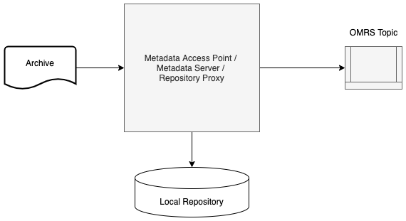
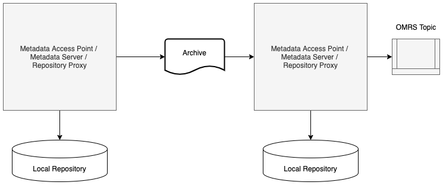
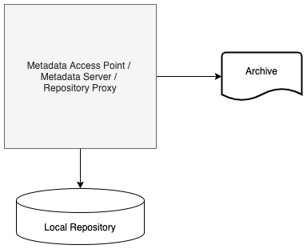

<!-- SPDX-License-Identifier: CC-BY-4.0 -->
<!-- Copyright Contributors to the ODPi Egeria project. -->
  
# Open Metadata Archives
  
The open metadata archives provide pre-canned content (open metadata types and instances) to load into an open metadata
repository.  There are two main types of open metadata archive:

* **Content packs** - read only metadata types and instances that are reusable in many organizations.
* **Metadata exports** - metadata exported from a specific open metadata repository that can act as a backup.
It is read-write if loaded into an open metadata repository with the same metadata collection id as the originating
repository, or read-only if loaded into a repository with a different metadata collection id.

Figure 1 shows a content pack being loaded into a metadata repository.  It is stored in the local repository
and distributed around any connected cohorts.  These types of archives can be provided by the
Egeria community and third party organizations.

> **Figure 1:** Loading a content pack

When data and other types of assets are being transported between organizations,
it is possible to use a metadata export open metadata archive to pass the related metadata as well.
This is shown in figure 2.

> **Figure 2:** Exporting and reimporting metadata between unconnected repositories

Figure 3 shows a metadata export archive to create a backup of selected metadata.
This can be used to recover the metadata repository content after a bad load or other operational error.

> **Figure 3:** Selective back up of metadata elements

## Creating open metadata archives

Open metadata archives are created through Java utilities.  There are two approaches:

* Content packs are created using the
[repository services archive utilities](../../open-metadata-implementation/repository-services/repository-services-archive-utilities).
The Egeria supported utilities for open metadata archives described at the bottom of this page use this
approach.

* Metadata export archives are created by using the repository services clients to extract
the metadata elements from a live repository and the to store them in the
archive using the
[repository services archive utilities](../../open-metadata-implementation/repository-services/repository-services-archive-utilities).

## Loading open metadata archives

A metadata server's configuration document can list the
archives to load each time the server is started.  This is useful if the server does not retain
metadata through a server restart (like the in memory metadata repository).
Open metadata archives may also be loaded while the server is running using a REST API call.

The archive is loaded once and its content is immediately available.
If the repository persists metadata over a server restart then this archive content
continues to be available after the server restarts.

It does not matter how many times an archive is loaded, only one copy of the content is
added to the repository.

## Inside an Open Metadata Archive

The open metadata archive has three parts to it.  This is shown in **Figure 4**.
The header defines the type of archive and its properties.  Then there is the type store.
This contains new types and updates to types (patches).  Finally there is the instance store.
This contains new instances (entities, relationships and classifications).

> **Figure 4:** Inside an Open Metadata Archive

The archive loads in the following order:

* Attribute Type Definitions (AttributeTypeDefs) from the type store.
  * PrimitiveDefs
  * CollectionDefs
  * EnumDefs
  
* New Type Definitions (TypeDefs) from the type store.
  * EntityDefs
  * RelationshipDefs
  * ClassificationDefs
  
* Updates to types (TypeDefPatches)

* New Instances
  * Entities
  * Relationships
  * Classifications

## Supported utilities for open metadata archives

Egeria supports the following open metadata archives.  Associated with each archive
are utilities that help you build additional archives of your own content.

* [Open Metadata Types](open-metadata-types) - the Egeria Open Metadata Type Definitions.
This archive is always loaded by each OMAG metadata repository server at start-up.
This is to reduce the chance that new types developed by a third party have names that conflict with the open metadata types.
There is also a utility to create the archive file for these open metadata types.
The find out more about the Open Metadata Types [click here](../../open-metadata-publication/website/open-metadata-types).

* [Open Connector Archives](open-connector-archives) - provides utilities for building
open metadata archives containing information about one or more connectors that
follow the [Open Connector Framework (OCF)](../../open-metadata-implementation/frameworks/open-connector-framework).
In addition, there are utilities for building an open metadata archive containing the connector type
definitions for Egeria's data store connectors.

* [Design Model Archives](design-model-archives) - provides utilities to
manage common/standard model content from third parties.  It includes
an example archive for the [Cloud Information Model (CIM)](https://cloudinformationmodel.org).

----
## Further information

More information about the processing of open metadata archives can be found in the
[repository services documentation](../../open-metadata-implementation/repository-services/docs/open-metadata-archive.md) module.

In addition these Administration Guide articles may be of interest:

* [Configuring an open metadata archive in an OMAG Server](../../open-metadata-implementation/admin-services/docs/user/configuring-the-startup-archives.md)
* [Adding an open metadata archive to a running OMAG Server](../../open-metadata-implementation/admin-services/docs/user/adding-archive-to-running-server.md)

----
* Return to [open-metadata-resources](..)
* Return to [Site Map](../../Content-Organization.md)
* Return to [Home Page](../../index.md)

----
License: [CC BY 4.0](https://creativecommons.org/licenses/by/4.0/),
Copyright Contributors to the ODPi Egeria project.
