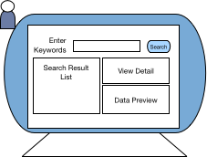
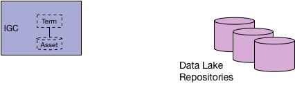
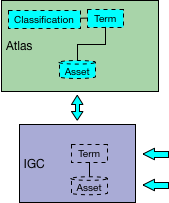
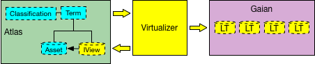
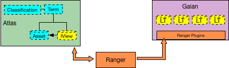
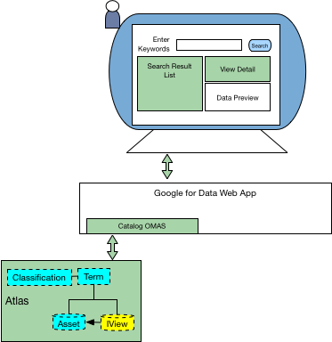
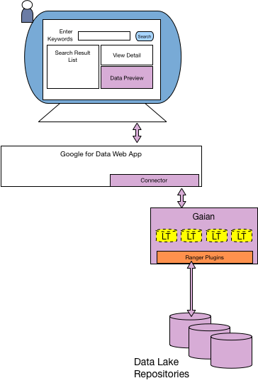
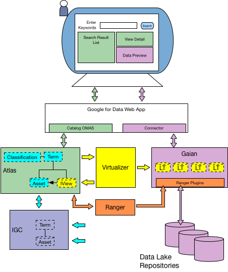

<!-- SPDX-License-Identifier: Apache-2.0 -->
  
# Virtual Data Connector (VDC) Demo
  
The virtual data connector demo shows metadata exchange between two open metadata
repositories and the use of this
metadata to configure a data virtualization platform with views and a security tool to provide
metadata-driven access control for the data virtualization platform.

It supports two basic use cases:

* An end user wishes to find some interesting data by searching the open metadata repositories.
* When they have found the data source they want, they wish to preview a subset of its data values
to verify that it really is the data they need.

These use cases seem simple but they raise three very important questions that create
an explosion of requirements in Egeria.

#### What metadata is required to describe the data sources such that the end user can accurately locate the data sources they need - assuming they are not familiar with the content and organization of the data sources?

Typically the end user would want to use meaningful business terms to describe
the data they need. They may also want so see:

* related descriptions of the data
* the profile of its data values
* the data's lineage
* information about the owners/stewards of the data, and the organization they come
from
* any license associated with the data

To provide this information, the VDC project needs to build out the
**[default types for open metadata](../../../open-metadata-publication/website/open-metadata-types)**
and **[provide a new catalog API](../../../open-metadata-implementation/access-services/asset-catalog)** and
**[interface for the understanding of data](../../../open-metadata-implementation/access-services/asset-consumer)**
based on these values.

#### What is the security model that determines which metadata and data each end user can see?

Specifically, how should access be controlled: particularly
in a self-service data exploration environment
where data is sourced from many different systems and organizations need access
in order to discover new uses and interesting patterns in the data?

In the VDC demo we are providing a single endpoint for accessing data
(this is the virtual data connector itself) that uses an [Apache Ranger](https://ranger.apache.org/) plugin to control access.
This demo automatically configures the tag-based security access in
Apache Ranger using information from the open
metadata repositories (see [Governance Engine OMAS](../../../open-metadata-implementation/access-services/governance-engine))
in order to provide security access based on both the
confidentiality classification tags (eg. `PII` and `SPI` tags) and the subject area of the data.

#### Where is the metadata and the data actually stored?

Consider the case where the end user is searching for additional sources for their
project and the data they need has not been provisioned into the a data lake - it is
still on the source systems.  However, these data sources are already catalogued
in another metadata repository.  To be valuable, the open metadata catalog search needs
to be able to cast its search to reach data and metadata repositories beyond the data lake
in order to locate all available data.

Once the end user has identified interesting sources, they may then request that the
data is provisioned into the data lake for further analysis.
The VDC project will introduce the frameworks, integration and adapter capability
to allow an enterprise view of the potential data sources, plus a metadata-driven
connector framework for connecting to both data and metadata repositories.  
These frameworks are part of the open metadata and governance story and include:

* **[Open Connector Framework (OCF)](../../../open-metadata-implementation/frameworks/open-connector-framework)** that provides a plugability mechanism for repositories
to plug into the open metadata ecosystem.
* **[Open Metadata Repository Services (OMRS)](../../../open-metadata-implementation/repository-services/README.md)** provides the federated queries and metadata exchange
required to search multiple repositories using a single request.
* **[Open Connector Implementations](../../../open-metadata-implementation/adapters/open-connectors/repository-services-connectors)** to plug into the OMRS.

## Walk-through of the VDC use case

Figure 1 shows a mock-up of

the **[catalog search UI](../../../open-metadata-implementation/user-interfaces/ui-chassis/ui-chassis-spring/README.md)** that the VDC supports.
A person can enter search queries and a list of potential data
sources are displayed on the left-hand side of the screen.
Selecting one of the search results causes more details of the metadata for
that entry to be displayed in the top right-hand side of the screen and underneath it,
a preview of the data (if the end user has permission to access the data).

> Figure 1: Catalog self service UI

At the start of the use case, details of the data repositories,
the mappings to the business glossary terms and the security classifications
are managed in a metadata repository, for example [IBM's Information Governance Catalog](https://www.ibm.com/marketplace/information-governance-catalog).  This is shown in Figure 2.

> Figure 2: IBM's Information Governance Catalog (IGC) holding data lake metadata

The first step is to replicate the metadata from IGC to another metadata repository, for example [Apache Atlas](https://atlas.apache.org), so it can be extended with additional characteristics that may not be supported by the first metadata repository (eg. to add virtual views).

This is shown in Figure 3.

> Figure 3: Replicating metadata from IGC to Apache Atlas

Since IGC remains the master copy of the original metadata,
the replication must be ongoing so that Apache Atlas remains up to date with the
latest metadata from IGC.

Thus the replication capability listens for
IGC events and converts them into OMRS events that can then be used to
drive updates through the OMRS repository connector API to the Apache Atlas repository.

The virtualizer is an optional component of the OMAG server that receives notifications
from the open metadata repositories through the 
[Information View OMAS](../../../open-metadata-implementation/access-services/information-view)
event topic and builds logical tables in [Gaian](https://github.com/gaiandb/gaiandb) as well and the
corresponding information view metadata in an open metadata repository.

[Gaian](../../../open-metadata-implementation/adapters/open-connectors/data-store-connectors/gaian-connector) is
an open source information virtualization technology.
The virtualizer is written to be modular so calls to a different virtualization
technology can be made at this point with a small change to the virtualizer. 

The aim of the VDC demo is to prove that an open metadata repository can dynamically
configure an information virtualization technology -- see Figure 4.

> Figure 4: Building information views with the virtualizer

Using a similar technique, the synchronization processes for Apache Ranger
pick up knowledge from the Governance Action OMAS that the Information Views
have been created/changed in Apache Atlas.
They push appropriate metadata to control access to the Apache Ranger server
which then configures 
Apache Ranger plugins in Gaian -- see Figure 5.

> Figure 5: Configuring enforcement points in Gaian using Apache Ranger

The Apache Ranger plugins hosted in Gaian cache all of the metadata they need
to make access decisions based on the user information passed on a request.

The system is now configured.
Subsequent changes to the IGC metadata will ripple through Apache Atlas, then the Virtualizer,
Apache Ranger and Gaian so they are consistent and up-to-date.

When the end user makes a search request, or clicks on a search result to see more detail, the request and response comes through the Catalog OMAS to Apache Atlas -- see Figure 6.

> Figure 6: Requesting catalog information from Apache Atlas

When the data preview is requested, Gaian is called to extract the data.
The Apache Ranger plugins validate the access request allowing Gaian to retrieve
the data from the data lake -- see Figure 7.

> Figure 7: Requesting data from Gaian

Figure 8 summarizes the whole end-to-end flow.

> Figure 8: End to end flow