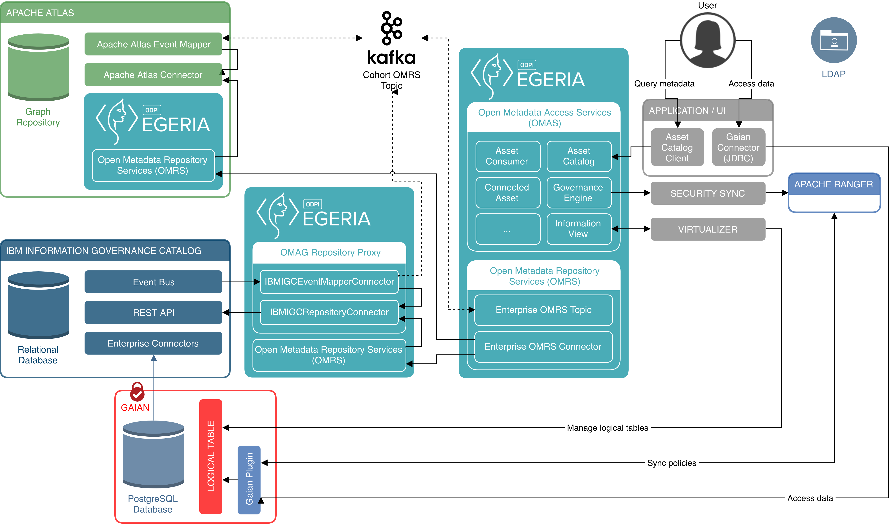

<!-- SPDX-License-Identifier: CC-BY-4.0 -->
<!-- Copyright Contributors to the Egeria project. -->

# open-metadata-deployment

## Overview

This module contains resources to assist in deployment of Egeria and related components. They are intended to
facilitate developer usage and technology demonstrations and will need further work to be suitable for production.

Currently the focus is on Helm charts to facilitate deployment to Kubernetes clusters.

Docker images are created independently from the Helm deployment, and where possible we plan to host them on Docker Hub.
(You can also build most of these images directly, and host them in your own registry, following the instructions under
the `docker` directory.)

The following illustrates the functional components included in the intended target state for the Helm `vdc` deployment:



> Figure 1: Functional overview of k8s `vdc` deployment

## Kubernetes install

**Note**: before following the steps below, ideally ensure that any pre-existing `kubectl`
configuration is moved (or removed), eg. from HomeBrew, as it may conflict with the one being
configured by Docker in the steps below.
(See https://docs.docker.com/docker-for-mac/#kubernetes)

The easiest way to experiment with kubernetes is to

1. Install Docker for Mac | Windows.
1. Go to `Preferences...` -> `Kubernetes` and ensure `Enable Kubernetes` is selected.
1. Start / wait for docker and kubernetes to be started.
1. Install Helm: for macOS (with [HomeBrew](https://brew.sh)) just use `brew install kubernetes-helm`.
1. Initialize helm with `helm init`.

For installing helm on other platforms see: https://docs.helm.sh/using_helm/#installing-helm

The instructions below assume using a local kubernetes. For cloud providers the noticeable differences will be:

- Typically needing to login to the cloud service via the CLI.
- Network can differ - in particular how ports are exposed outside the cluster, and whether you should use NetworkPort,
    LoadBalancer or other options.
- Once configured, use `kubectl config use-context` to switch between operating with different clouds or local.

## Helm configuration

To make use of Helm and its charts, first run through the following steps to ensure the charts we
want to make use of will be available.

### Add chart repositories

Start by adding the chart repositories we will need with the following helm command:

```bash
$ helm repo add confluent https://confluentinc.github.io/cp-helm-charts/
"confluent" has been added to your repositories
```

This repository is needed for the Kafka chart on which our deployment depends.

Then update your local repository index with the following command:

```bash
$ helm repo update
Hang tight while we grab the latest from your chart repositories...
...Skip local chart repository
...Successfully got an update from the "confluent" chart repository
...Successfully got an update from the "stable" chart repository
Update Complete. * Happy Helming!*
```

## Usage

By default, the `vdc` chart deploys the various components illustrated in the overview (with the exception of IBM
Information Governance Catalog) into a k8s cluster. The intention of the chart is to setup an environment that can be
used to demonstrate a Virtual Data Connector ("VDC") that makes use of metadata across multiple repositories (eg. Apache
Atlas and IBM IGC) to control access to data within a database (PostgreSQL), through a virtualized access layer (Gaian).

*(Be aware that this is very much still in a preview state, and not all pieces may yet be deployed or fully working.)*

**Important**: Make sure your starting directory is `open-metadata-resources/open-metadata-deployment/charts`.

### Downloading the chart's dependencies

Start by downloading the chart's dependencies. To do this, from the `open-metadata-resources/open-metadata-deployment`
directory referenced as the starting point above, run the following:

```bash
$ helm dependency update vdc
Hang tight while we grab the latest from your chart repositories...
...Unable to get an update from the "local" chart repository (http://127.0.0.1:8879/charts):
	Get http://127.0.0.1:8879/charts/index.yaml: dial tcp 127.0.0.1:8879: connect: connection refused
...Successfully got an update from the "confluent" chart repository
...Successfully got an update from the "stable" chart repository
Update Complete. ⎈Happy Helming!⎈
Saving 2 charts
Downloading cp-helm-charts from repo https://confluentinc.github.io/cp-helm-charts/
Downloading openldap from repo https://kubernetes-charts.storage.googleapis.com/
Deleting outdated charts
```

### Configuring environment-specific values

By default, the chart will deploy everything it requires into your k8s cluster, including Zookeeper, Kafka, etc. You
may already have such components available, however, that you want to re-use. You can therefore override these so that
they are not deployed as part of the cluster but simply re-use your existing resources.

To simplify various configuration scenarios, you can put each of these options into its own separate YAML file: you can
then run the helm installation step passing multiple such files to suit your specific configuration requirements for
that deployment.

#### Apache Kafka

The following properties will disable the internally-deployed Kafka (and Zookeeper) components, and instead make use of
a pre-existing Apache Kafka (with Zookeeper) environment:

```yaml
kafka:
  internal:
    enabled: false
  external:
    hostname: "my.host.somewhere.com"
    ip: "1.2.3.4"
    port: "9092"
```

When `kafka.internal.enabled` is set to `true` (as it is by default), the options under `external` are simply ignored.

#### IBM IGC

Because it is licensed commercial software, by default IBM InfoSphere Information Governance Catalog ("IGC") is not
used as part of the demonstration (ie. it's configuration is disabled). To make use of it, you will need to have a
pre-existing environment, or have [your own (experimental, unsupported) container](https://github.com/IBM/ansible-role-infosvr/tree/master/docker)
available with IGC running within it.

These options can then be used to make use of such an environment as part of your setup:

```yaml
ibmigc:
  enabled: true
  internal:
    enabled: false
  external:
    hostname: "infosvr.vagrant.ibm.com"
    ip: "1.2.3.4"
    port: "9446"
```

Crucially, the `igc.enabled` setting must be set to `true` (by default it is `false`, causing IGC configuration to be
disabled). The remaining options are similar to those for Kafka: setting `igc.internal.enabled` to `true` will make use
of a container (you specify the image name and repository for this in `vdc/templates/values.yaml`), or if set to `false`
will use the further variables under `igc.external` to define the network location of your pre-existing IGC environment.

Note if using IBM Cloud, IGC in a container (ibmigc.internal) is not working correctly. See https://github.com/odpi/egeria/issues/906 for further details.

Also check the settings in `vdc/templates/configmap.yaml` to ensure they are set to match your environment.

### Deploying the demonstration

Run the following command (providing zero or more of the files you configured in the step immediately above, and any
unique name you like for the `--name` parameter):

```bash
$ helm install vdc [-f kafka.yml -f igc.yml ...] --name local
```

This can take some time to run, as the command will not return until:

- All required docker images have been pulled from their repositories (some of which are large, so depending on network
    connectivity, etc this can take considerable time the very first time it is run)
- The k8s Job constructs have completed (or timed out) in initializing the various components

You may therefore want to open a second window (or run this command in the background) and run something like the
following to monitor the progress of the install (automatically refreshing the status every second):

```bash
$ watch -n 1 "kubectl get pods"
```

Note that the value you provide for the `--name` parameter becomes a meaningful prefix to the various components you
are deploying.

See [more information on k8s operations](docs/k8s-ops.md) for further details on interacting with the deployed
components and what they include.
