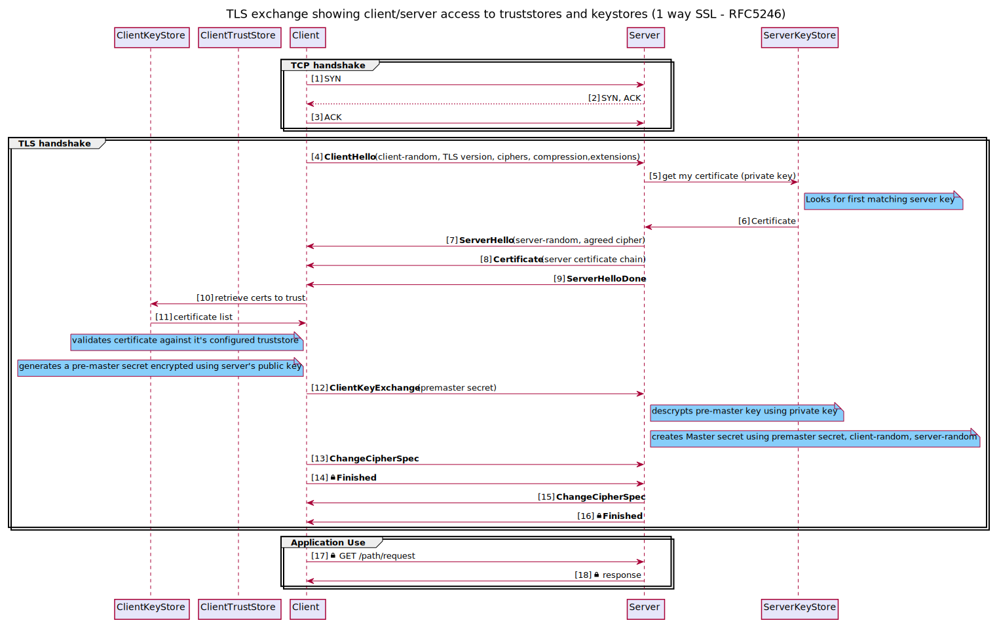

<!-- SPDX-License-Identifier: CC-BY-4.0 -->
<!-- Copyright Contributors to the Egeria project. -->

## TLS protocol
### One-way SSL exchange

### Two-way (mutual) SSL exchange

### Additional Notes 
####Building diagrams

Rendered image files are checked in, however when updating, the diagrams can be regenerated using 
 
For example: 
`plantuml -svg ssl-oneway.puml` 

The diagrams are best rendered to svg, however notes do not render with a background if using the IntelliJ markdown plugin.
They do render correctly if opened directly in IntelliJ, as well as in a browser

It's also recommended to install the IntelliJ 'PlantUML' plugin to get a real-time preview whilst updating the diagrams.

