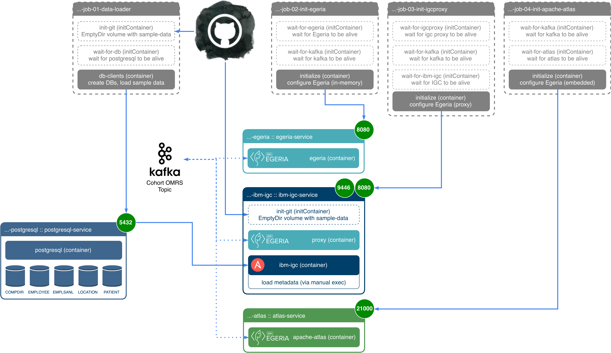

<!-- SPDX-License-Identifier: CC-BY-4.0 -->
<!-- Copyright Contributors to the Egeria project. -->

# More information on k8s operations

## Overview

The Helm deployment uses a number of different k8s mechanisms to setup the components:

- `Service`s are used to expose specific ports into the running containers so that they are accessible from outside the
    cluster.
- `Deployment`s are used to create `Pod`s, which are the k8s construct used to ensure that the desired containers are
    running. In addition, `initContainers` within the `Deployment`s are used for setup and orchestration, such as
    ensuring that a particular dependent service is running before attempting to startup a subsequent container that
    depends on that other service.
- `Job`s are used to do temporal setup tasks, such as loading data or sending in dynamic configurations to the
    containers: allowing us to make these changes at runtime of the cluster, rather than at the build-time of the
    underlying Docker images. (Which also means we can re-use official images for various components like PostgreSQL
    rather than needing to build our own.)

The following diagram illustrates some of this orchestration within the deployment process itself (where the grey boxes
are the temporal `Job`s, the colour-outlined boxes are `Pod`s, within which are `container`s, and the green circles
illustrate the port numbers exposed as `Service`s (internally within the cluster):



> Figure 1: Deployment overview

## Interacting with the deployed components

### Finding out the network address/IP

Once deployed, there will be a number of components accessible: a UI for Egeria, a UI for Apache Atlas, (a UI for IGC,
if deployed), etc.

The simplest method for determining the network address and IPs that kubernetes is exposing for external access is its
`get services` command:

```bash
$ kubectl get services
NAME                            TYPE        CLUSTER-IP       EXTERNAL-IP   PORT(S)                                                                      AGE
kubernetes                      ClusterIP   10.96.0.1        <none>        443/TCP                                                                      2d
local-cp-kafka                  ClusterIP   10.106.142.155   <none>        9092/TCP                                                                     42s
local-cp-kafka-headless         ClusterIP   None             <none>        9092/TCP                                                                     42s
local-cp-zookeeper              ClusterIP   10.109.88.78     <none>        2181/TCP                                                                     42s
local-cp-zookeeper-headless     ClusterIP   None             <none>        2888/TCP,3888/TCP                                                            42s
local-openldap                  ClusterIP   10.97.145.22     <none>        389/TCP,636/TCP                                                              42s
local-vdc-atlas-service         NodePort    10.107.206.23    <none>        21000:31000/TCP                                                              42s
local-vdc-egeria-service        NodePort    10.103.23.234    <none>        9443:30080/TCP                                                               42s
local-vdc-gaian-service         NodePort    10.99.183.202    <none>        6414:30414/TCP                                                               42s
local-vdc-ibm-igc-service       NodePort    10.96.13.54      <none>        9443:30081/TCP,9446:32446/TCP                                                42s
local-vdc-omrsmonitor-service   NodePort    10.96.170.162    <none>        58080:31080/TCP                                                              42s
local-vdc-postgresql-service    NodePort    10.103.139.227   <none>        5432:30432/TCP                                                               42s
local-vdc-ranger-service        NodePort    10.97.32.163     <none>        6080:32080/TCP,6182:30182/TCP,6083:31682/TCP,6183:32006/TCP,3306:31734/TCP   42s
local-vdc-ui-service            NodePort    10.97.225.131    <none>        8443:30443/TCP                                                               42s
```

From the list above you can see that the Egeria service (`local-vdc-egeria-service`) is available externally on port
`30080`, Apache Atlas (`local-vdc-atlas-service`) on port 31000, and so on.

More detail can be obtained about any particular service using the `describe service` command:

```bash
$ kubectl describe service local-vdc-egeria-service
Name:                     local-vdc-egeria-service
Namespace:                default
Labels:                   app.kubernetes.io/component=egeria-service
                          app.kubernetes.io/instance=local
                          app.kubernetes.io/managed-by=Tiller
                          app.kubernetes.io/name=vdc
                          helm.sh/chart=vdc-0.1.10
Annotations:              <none>
Selector:                 app.kubernetes.io/component=egeria-service,app.kubernetes.io/instance=local,app.kubernetes.io/name=vdc
Type:                     NodePort
IP:                       10.103.23.234
LoadBalancer Ingress:     localhost
Port:                     <unset>  9443/TCP
TargetPort:               9443/TCP
NodePort:                 <unset>  30080/TCP
Endpoints:                10.1.0.98:9443
Session Affinity:         None
External Traffic Policy:  Cluster
Events:                   <none>
```

- The `IP` is the internal IP of the pod running the Egeria service - and only accessible within kubernetes. It can
    change constantly as pods are started/stopped/restarted.
- `TargetPort` is the port exposing the service on the pod (internally).
- `Endpoints` is the cluster IP for the service. This remains stable and will automatically redirect to the correct pod(s).
- `NodePort` gives the external port now exposed - in this case `30080`. The interpretation of this varies depending
    on provider (the example here is for Docker on MacOS).
- Hence, `https://localhost:30080` would be the baseURL of the Egeria service.

The `kubectl` command allows you to extensively explore the kubernetes resources, but is best explored
through [its own reference material](https://kubernetes.io/docs/reference/kubectl/overview/).

### Finding a list of deployed charts

If you're unsure which charts are deployed, use the following helm command to list them:

```bash
$ helm list
NAME 	REVISION	UPDATED                 	STATUS  	CHART     	APP VERSION	NAMESPACE
local	1       	Fri Feb  8 09:57:36 2019	DEPLOYED	vdc-0.1.10	           	default
```

### Checking the status of a helm chart

Recall that in the examples above, we named our deployment `local` (as also seen when using the `list` command).
To check the status of the deployment (ie. that everything is up and running, as it may take a
few minutes for everything to startup), use this command:

```bash
$ helm status local
LAST DEPLOYED: Fri Feb  8 09:57:36 2019
NAMESPACE: default
STATUS: DEPLOYED

RESOURCES:
==> v1/Deployment
NAME                                DESIRED  CURRENT  UP-TO-DATE  AVAILABLE  AGE
local-vdc-atlas-deployment          1        1        1           1          2m59s
local-vdc-egeria-deployment         1        1        1           1          2m59s
local-vdc-gaian-deployment          1        1        1           1          2m59s
local-vdc-igcproxy-deployment       1        1        1           1          2m59s
local-vdc-kafka-monitor-deployment  1        1        1           1          2m59s
local-vdc-omrsmonitor-deployment    1        1        1           1          2m59s
local-vdc-postgresql-deployment     1        1        1           1          2m59s
local-vdc-rangeradmin               1        1        1           1          2m59s
local-vdc-ui-deployment             1        1        1           1          2m59s

==> v1beta1/StatefulSet
NAME                DESIRED  CURRENT  AGE
local-cp-kafka      3        3        2m59s
local-cp-zookeeper  3        3        2m59s

==> v1/Pod(related)
NAME                                                READY  STATUS   RESTARTS  AGE
local-openldap-55c8cf6cc-tncd7                      1/1    Running  0         2m59s
local-vdc-atlas-deployment-6b78d7b8d4-qbxf4         2/2    Running  0         2m59s
local-vdc-egeria-deployment-5cf76f8555-86fqp        2/2    Running  0         2m59s
local-vdc-gaian-deployment-677d59fbb5-rtcht         1/1    Running  0         2m59s
local-vdc-igcproxy-deployment-57b675dbc5-7jt2d      2/2    Running  0         2m59s
local-vdc-kafka-monitor-deployment-cdfdc5975-5cf46  1/1    Running  0         2m59s
local-vdc-omrsmonitor-deployment-696dd5d778-9wdx4   1/1    Running  0         2m59s
local-vdc-postgresql-deployment-6969bddc64-scvhw    2/2    Running  0         2m58s
local-vdc-rangeradmin-c68dc7c4b-8kw98               2/2    Running  0         2m58s
local-vdc-ui-deployment-699b56b8ff-6b24d            1/1    Running  0         2m58s
local-cp-kafka-0                                    2/2    Running  0         2m59s
local-cp-kafka-1                                    2/2    Running  0         2m30s
local-cp-kafka-2                                    2/2    Running  0         2m10s
local-cp-zookeeper-0                                2/2    Running  0         2m58s
local-cp-zookeeper-1                                2/2    Running  0         2m31s
local-cp-zookeeper-2                                2/2    Running  0         2m4s

==> v1beta1/PodDisruptionBudget
NAME                    MIN AVAILABLE  MAX UNAVAILABLE  ALLOWED DISRUPTIONS  AGE
local-cp-zookeeper-pdb  N/A            1                1                    2m59s

==> v1/Secret
NAME            TYPE    DATA  AGE
local-openldap  Opaque  2     2m59s

==> v1/ConfigMap
NAME                              DATA  AGE
local-cp-kafka-jmx-configmap      1     2m59s
local-cp-zookeeper-jmx-configmap  1     2m59s
local-openldap-env                6     2m59s
local-vdc-configmap               28    2m59s

==> v1/Service
NAME                           TYPE       CLUSTER-IP      EXTERNAL-IP  PORT(S)                                                                     AGE
local-cp-kafka-headless        ClusterIP  None            <none>       9092/TCP                                                                    2m59s
local-cp-kafka                 ClusterIP  10.106.142.155  <none>       9092/TCP                                                                    2m59s
local-cp-zookeeper-headless    ClusterIP  None            <none>       2888/TCP,3888/TCP                                                           2m59s
local-cp-zookeeper             ClusterIP  10.109.88.78    <none>       2181/TCP                                                                    2m59s
local-openldap                 ClusterIP  10.97.145.22    <none>       389/TCP,636/TCP                                                             2m59s
local-vdc-atlas-service        NodePort   10.107.206.23   <none>       21000:31000/TCP                                                             2m59s
local-vdc-egeria-service       NodePort   10.103.23.234   <none>       9443:30080/TCP                                                              2m59s
local-vdc-gaian-service        NodePort   10.99.183.202   <none>       6414:30414/TCP                                                              2m59s
local-vdc-igcproxy-service     NodePort   10.96.13.54     <none>       9443:30081/TCP                                                              2m59s
local-vdc-omrsmonitor-service  NodePort   10.96.170.162   <none>       58080:31080/TCP                                                             2m59s
local-vdc-postgresql-service   NodePort   10.103.139.227  <none>       5432:30432/TCP,22:30471/TCP                                                 2m59s
local-vdc-ranger-service       NodePort   10.97.32.163    <none>       6080:32080/TCP,6182:30182/TCP,6083:31682/TCP,6183:32006/TCP,3306:31734/TCP  2m59s
local-vdc-ui-service           NodePort   10.97.225.131   <none>       8443:30443/TCP                                                              2m59s

==> v1beta2/Deployment
NAME            DESIRED  CURRENT  UP-TO-DATE  AVAILABLE  AGE
local-openldap  1        1        1           1          2m59s
```

In the example above, everything is started and running (as indicated by the `1/1` and `Running` status for the pods.)

### Removing a chart when finished

To remove the chart when no longer needed, use helm's delete command:

```bash
$ helm delete --purge local
release "local" deleted
```

This will ensure the pods and resources are stopped (terminated), and removed from kubernetes,
without needing to know the multiple commands this actually requires through kubernetes itself.

(Note that you need to use the `--purge` option to purge the chart if you intend to use the same name at some point in
the future.)

### Removing Jobs

You may run into circumstances where the `Job`s used for initial setup have been left behind: typically this is because
there was either some error during their execution (in which case they are left behind so their logs can be reviewed),
or there was a timeout during the Helm deployment (which prevents Helm from cleaning them up itself).

Regardless, you can manually review the `Job`s still in your cluster using the following command:

```bash
$ kubectl get jobs
```

Note that the `Job`s themselves have fairly static names (like `Service`s), though their temporal `Pod`s will have
unique names like any other `Pod`. To review the logs of a job, simply use the same logging you would for a pod
(`kubectl logs -f <podName>`). However, to delete the `Job` you will need to use the job name from the command above:

```bash
$ kubectl delete job <jobName>
```

----
License: [CC BY 4.0](https://creativecommons.org/licenses/by/4.0/),
Copyright Contributors to the ODPi Egeria project.
