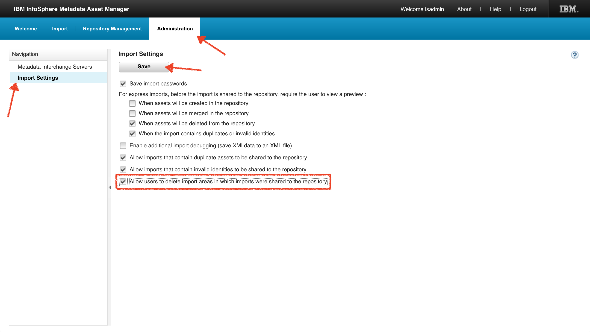

<!-- SPDX-License-Identifier: CC-BY-4.0 -->
<!-- Copyright Contributors to the ODPi Egeria project. -->

# Coco Pharmaceuticals

The Coco Pharmaceuticals samples follow the examples outlined in the Egeria tutorials and
are based on the description of the imaginary company and its employees in the
[ODPi Data Governance Project](https://odpi.github.io/data-governance/).

The samples themselves broadly fit into two categories:

- data: provided as both sample files and database tables
- metadata: provided as archives that can be loaded into one or more metadata repositories

## Requirements

The simplest way to deploy the samples is as part of the complete kubernetes-based demo environment,
based on the provided Helm charts under [open-metadata-deployment](../../README.md).

Alternatively, if you want to make use of a pre-existing IBM InfoSphere Information Governance Catalog
repository, you will need:

- Ansible v2.4.x (ideally the latest v2.7.x+)
- Network access to the IBM Information Server environment
- Inventory group names setup the same as `IBM.infosvr` role
- Following Ansible roles installed:
  - [IBM.infosvr](https://galaxy.ansible.com/IBM/infosvr)
  - [IBM.infosvr-metadata-asset-manager](https://galaxy.ansible.com/IBM/infosvr-metadata-asset-manager)
  - [IBM.infosvr-import-export](https://galaxy.ansible.com/IBM/infosvr-import-export)

## Included samples

Data:

- 5 databases, loadable to either PostgreSQL, MariaDB, or IBM DB2
- 8 sample files (semi-colon separated CSV)

Metadata:

- Glossary categories
- Glossary terms
- Term-to-term relationships
- Relationships between terms and file fields
- Relationships between terms and database columns

IBM Information Governance Catalog-specific:

- IBM Information Analyzer project containing the sample database tables
- IBM Information Server users
- IBM Information Server groups
- IBM IGC stewards

## Loading the samples to your environment

### Data

When deploying the demo kubernetes setup, the provided sample data will be loaded to the database automatically
(postgresql by default) as part of the setup.

If you are using an external or pre-existing database, you'll need to first setup an inventory file (see instructions
below under Metadata), and also configure your settings in the `defaults/main.yml` file. You can then use the provided
`deploy-data.yml` playbook to deploy the sample data (using Ansible):

```bash
$ ansible-playbook -i hosts deploy-data.yml
```

### Metadata

When using a pre-built IBM InfoSphere Information Server container, the playbooks are built-in to the container during
its startup, to avoid any need for SSH or other utilities to provide remote access to the container itself. The sample
playbooks and artifacts are all placed under
`/samples/egeria/open-metadata-resources/open-metadata-deployment/sample-data/coco-pharmaceuticals`, pulled directly
from the `master` branch of the Egeria GitHub repository.

For installing against your own pre-existing IBM InfoSphere Information Server environment, simply use the provided
playbooks within these directories from your own locally-cloned repository.

See `defaults/main.yml` for the default locations and names of the physical assets (database and files).
These are probably most easily overridden directly in this file; alternatively, you can override them directly in the
playbook command as in the example of overriding `egeria_samples_db_host_remote` below (which is the one variable you
will almost certainly need to override, with the name of the postgresql service within your cluster).

Running the playbook is as simple as:

```bash
$ ansible-playbook [-i hosts] deploy-metadata.yml -e egeria_samples_db_host_remote="<helmName>-vdc-postgresql-service"
```

When running inside a container, the connectivity should already be preset globally so there is no need to specify an
inventory file. You simply need to get inside your container to run the playbook by running a command like the
following (the first to get the unique name of your pod, the second to get a command-line within it):

```bash
$ kubectl get pods | grep 'ibm-igc'
local-vdc-ibm-igc-65c4f66888-k6q2n      1/1       Running   0          25m
$ kubectl exec -it local-vdc-ibm-igc-65c4f66888-k6q2n /bin/bash
```

For deploying to a pre-existing Information Server environment, the inventory provided (via `-i hosts`)
should contain at a minimum the following group names:

- `egeria_samples_db_host` group, defining the host containing the database into which the sample data should be loaded.
- `egeria_samples_files_host` group, defining the host where the sample data files should be loaded.

If using IGC as a metadata repository, the inventory should also contain the group names required by
the `IBM.infosvr` role for the repository, engine and domain (services) tiers.
(See `hosts.sample` for an example, re-using the IBM DB2 installation behind Information Server itself
as the location for the sample data and with all tiers of IBM Information Server running on a single host.)

The playbook will automatically create (or update) all of the needed assets, idempotently,
as well as kicking off the harvesting of metadata through IBM Metadata Asset Manager and
(in v11.7+) the automated analysis of the database samples through Information Analyzer.

If you have configured the [IGC Repository Connector](https://github.com/odpi/egeria-connector-ibm-information-server)
in advance of running the playbook, including the event mapper configuration, you will also
see events published into the cohort for all of these samples as well as part of the load 
process.

## Removing the samples from your environment

A removal playbook is also provided to clean the samples from your environment, allowing you
to repeat the load process if you so desire.

Run the removal playbook as follows:

```bash
ansible-playbook [-i hosts] remove-metadata.yml -e egeria_samples_db_host_remote="<helmName>-vdc-postgresql-service"
```

Where the inventory provided is as described above for loading.

Note that to fully remove artifacts from an IGC environment you must also allow import areas to
be deleted from IBM Metadata Asset Manager. This requires a manual configuration change as follows
(which must be completed before running the removal playbook):



1. Navigate to the "Administration" tab.
1. Open the "Import Settings" under Navigation.
1. Tick the box next to "Allow users to delete import areas in which imports were shared to the repository".
1. Click the "Save" button.

Alternatively, if you *really* want to start with the same base metadata environment, and you're making use of
containers, you could also simply delete the pod running the repository and let it get re-created fresh:

```bash
$ kubectl get pods | grep 'ibm-igc'
local-vdc-ibm-igc-65c4f66888-k6q2n      1/1       Running   0          25m
$ kubectl delete pod local-vdc-ibm-igc-65c4f66888-k6q2n
```

----
License: [CC BY 4.0](https://creativecommons.org/licenses/by/4.0/),
Copyright Contributors to the ODPi Egeria project.
