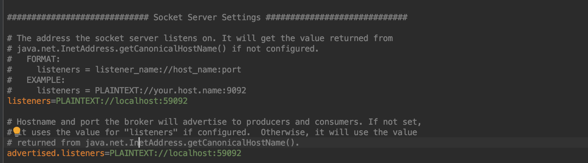

<!-- SPDX-License-Identifier: CC-BY-4.0 -->
<!-- Copyright Contributors to the ODPi Egeria project. -->


# Open Metadata Labs

The open metadata labs contains Jupyter notebooks
that allow you to try different capabilities of the ODPi Egeria.

Each notebook describes a scenario from the
[Coco Pharmaceuticals](https://github.com/odpi/data-governance/tree/master/docs/coco-pharmaceuticals)
case study, focusing on a challenge that one or more of the personas face and
how they approached the solution.

The calls to the Egeria APIs necessary to complete the challenge are encoded in
the notebook so you can experiment with the APIs.

They are organized as follows:

* [Setting up and running Egeria Servers](administration)
* [Building as asset catalog](asset-management)

The open metadata labs can be used for individual study,
as part of a class and/or as e basis of a workbook for
using Egeria within a specific organization.

## Running the Labs

There are three main ways to run these labs:
* Using `docker-compose` to start the environment using Docker containers.
* Using our Kubernetes containers.
* Using your own local environment.

### Using docker-compose

The `docker-compose` command starts up Docker containers.
This does require [Docker](https://www.docker.com/), and is typically ran locally within
the container environment, but is fairly simple and lightweight.

See [https://github.com/odpi/egeria/tree/master/open-metadata-resources/open-metadata-deployment/compose/tutorials](https://github.com/odpi/egeria/tree/master/open-metadata-resources/open-metadata-deployment/compose/tutorials)


### Using Kubernetes

Kubernetes is useful for many kinds of deployments,
and is highly flexible, so other scenarios beyond simple
labs are best addressed in this kind of environment.
It is also a good approach for running on a cloud provider and for
learning more about Kubernetes and general Egeria deployment.

See [https://github.com/odpi/egeria/tree/master/open-metadata-resources/open-metadata-deployment/charts/lab](https://github.com/odpi/egeria/tree/master/open-metadata-resources/open-metadata-deployment/charts/lab)

### Locally / self setup

If you have egeria running locally, you can run the labs without any dependency on container infrastructure.
Follow the [OMAG Server Platform tutorial](../open-metadata-tutorials/omag-server-tutorial/task-starting-the-omag-server-platform.md)
for instructions on how to set up and run a platform yourself.
You need to start three OMAG Server Platforms at the following URLs:

* `http://localhost:8080`
* `http://localhost:8081`
* `http://localhost:8082`

In addition, you need Apache Zookeeper managing an Apache Kafka server that is running at a PLAINTEXT listener at
`http://localhost:59092`.  Apache Kafka includes Apache Zookeeper.  Download and install Apache Kafka.
From the directory where Kafka is installed, edit the `config/server.properties` file so that the `listeners`
and `advertised.listeners` are set up as follows.



Change into Kafka's `bin` directory and issue the following commands:
```
$ ./zookeeper-server-start.sh ../config/zookeeper.properties &
$ ./kafka-server-start.sh ../config/server.properties &
```

Then you are ready to run the labs - we suggest that you begin with the [read-me-first](./read-me-first.ipynb) lab notebook.

----
License: [CC BY 4.0](https://creativecommons.org/licenses/by/4.0/),
Copyright Contributors to the ODPi Egeria project.
