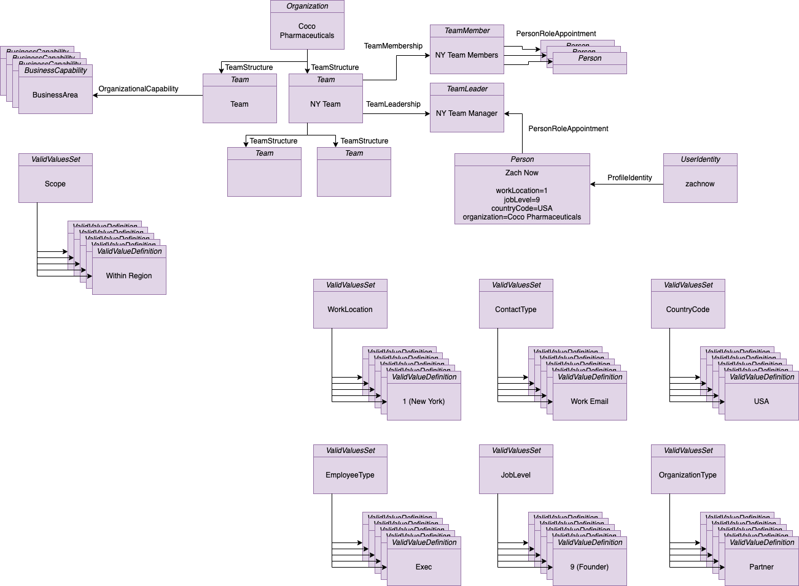
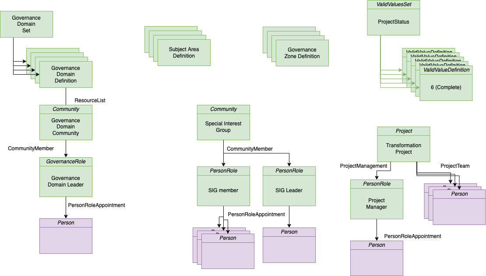
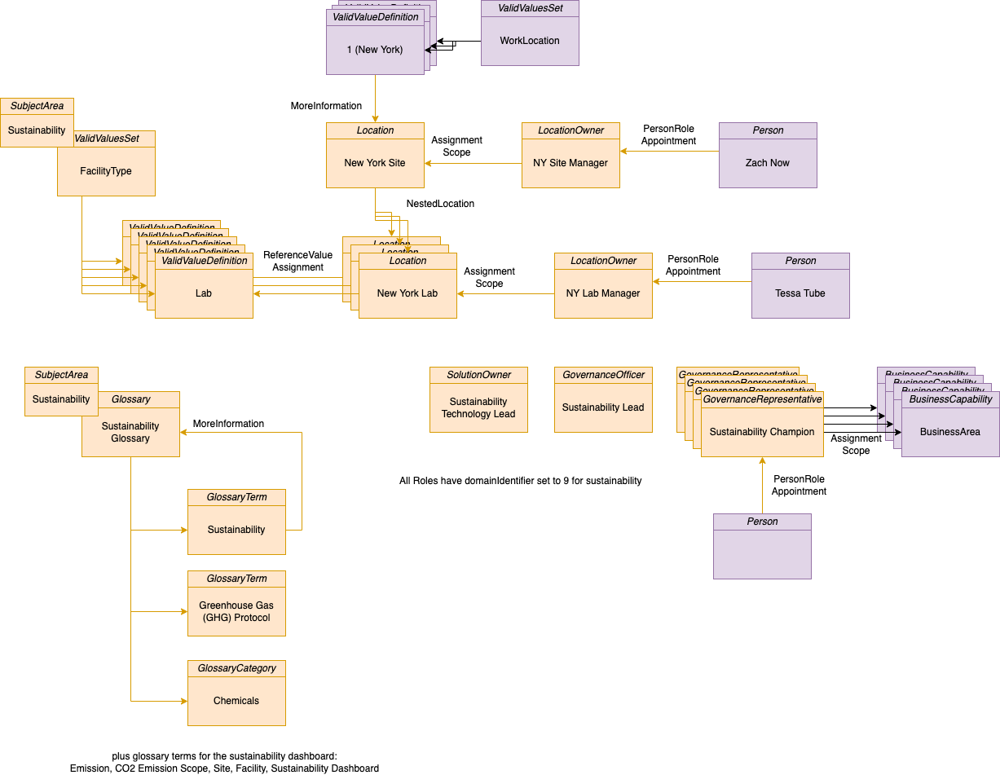

<!-- SPDX-License-Identifier: CC-BY-4.0 -->
<!-- Copyright Contributors to the ODPi Egeria project. -->

# Sample metadata archives for Coco Pharmaceuticals

This directory contains the code to generate open metadata archives containing pre-canned sample metadata used to
prime Coco Pharmaceuticals' metadata repositories.

Open metadata archives are JSON files that contain open metadata types and instances.  They are loaded into
an Egeria Metadata Server either at start up or once the server is running. 

It does not matter how many times an archive are loaded into a metadata server - nor if the same archive is
loaded into different metadata servers in the same cohort.  The content of the archive is shared without resulting
in duplicates.

There are 7 archives used in the Coco Pharmaceuticals labs and demos:

* **Additional open metadata types** - provides additional types for Coco Pharmaceuticals.

* **Coco Pharmaceuticals Organizations** - provides the profiles, user identifies and team of the featured
  personas of Coco Pharmaceuticals.

* **Governance Program Definitions** - provides the metadata to describe Coco Pharmaceuticals governance program.

* **Templates for the Drop Foot Clinical Trials** - provides the template assets
  used for onboarding weekly patient measurements during a clinical trial.

* **Governance Engine Definition** - provides the metadata to describe Coco Pharmaceuticals quality governance engine: `AssetQuality`.

* **Coco Pharmaceuticals Business Systems** provides a catalog of the business systems and the lineage between
  them and the load of their data into the data lake.  This archive simulates the type of metadata expected from
  an ETL tool suite.  It is intended for **cocoMDS5** in the open metadata labs.

* **Coco Pharmaceuticals Sustainability Initiative** provides the base definitions for Coco Pharmaceutical's
  sustainability initiative.  This includes:

## Further reading

* [Open Metadata Archives](https://egeria-project.org/concepts/open-metadata-archive/)
* [Egeria Metadata Access Stores](https://egeria-project.org/egeria-docs/concepts/metadata-access-store/)

----
License: [CC BY 4.0](https://creativecommons.org/licenses/by/4.0/),
Copyright Contributors to the ODPi Egeria project.