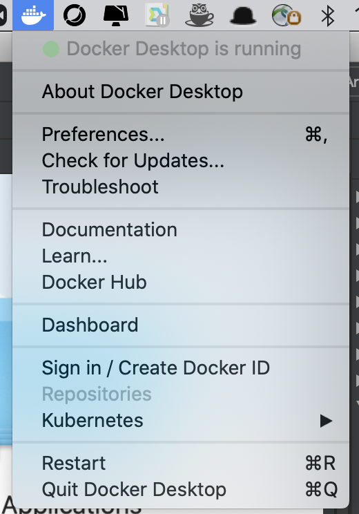
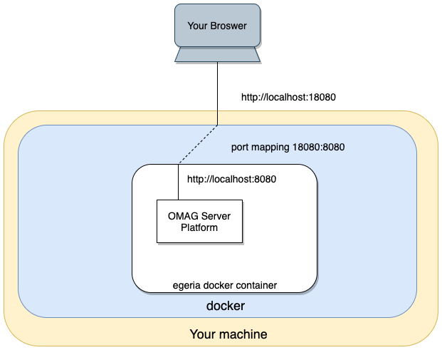
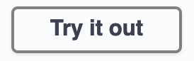

<!-- SPDX-License-Identifier: CC-BY-4.0 -->
<!-- Copyright Contributors to the ODPi Egeria project 2020. -->

# Docker tutorial

This tutorial explains how to use the Egeria Docker Image published to the
docker catalog at [https://hub.docker.com/r/odpi/egeria](https://hub.docker.com/r/odpi/egeria).

Egeria's docker image includes the Egeria install image.  When the image is started
using docker, a new egeria docker container is created.  As it starts up, an instance of
the Egeria runtime - that is the
[OMAG Server Platform](../../../open-metadata-implementation/admin-services/docs/concepts/omag-server-platform.md) -
is started at port https 9443.

This container can be incorporated into larger container orchestration environments or used standalone.
This tutorial describes how to use it standalone.  The [Open Metadata Labs](../../open-metadata-labs)
use this container with either the `docker-compose` or `Kubernetes`
container services to create a complete open metadata solution.
Link to [Hands-on Labs Infrastructure Guide](../lab-infrastructure-guide) to learn more.

## Working with Egeria's docker image

If docker is new to you and you don't have it installed,
link to the article on docker in the [developer tools](../../../developer-resources/tools/Docker.md).
This provides an overview of docker and installation instructions for Docker Desktop.

Once the docker desktop is installed, start the docker desktop application.
It may take a little while to complete its start up so check it is running before continuing.

For example, on macOS, the docker desktop can be found on the **Launchpad**. Once it is running,
the docker whale icon appears on the top menu bar.  Clicking on the docker whale icon reveals a menu
and the status of the desk top is visible. 
This menu is used to shutdown docker at the end of the dojo.



----

## Downloading the egeria docker image

The command to download Egeria's docker image is `docker pull odpi/egeria`.
This is issued from a command/terminal window in the directory where you want the
container to be copied to.

If you see the following response, then the docker runtime is not installed properly on your machine.

```bash
$ docker pull odpi/egeria
-bash: docker: command not found
```

If all is well, the image downloads.  Notice it is pulling the latest master build by default.

```bash
$ docker pull odpi/egeria
Using default tag: latest
latest: Pulling from odpi/egeria
e7c96db7181b: Pull complete 
f910a506b6cb: Pull complete 
b6abafe80f63: Pull complete 
a83b87485b54: Pull complete 
10d9ee7d5688: Pull complete 
9558171b7a95: Pull complete 
Digest: sha256:18451a4676a6688e03f284f887ba5be7026c17805ee0b919ed02cb131621d45b
Status: Downloaded newer image for odpi/egeria:latest
docker.io/odpi/egeria:latest
$
```
To check it will run, try the `docker run --publish 19443:9443 odpi/egeria`.
This will start the image as a new docker container.  As the container initializes it starts a single copy of the
[OMAG Server Platform](../../../open-metadata-implementation/admin-services/docs/concepts/omag-server-platform.md).
The OMAG Server Platform is the Egeria runtime platform where the Egeria REST services run.

The `--publish 19443:9443` parameter maps the 9443 port inside the docker that the OMAG Server Platform
has registered with to port 19443



You should see the server logo come up and finally a message 
`OMAG server platform ready for more configuration`.  This message means it has successfully started.

Once you can see that it has started, use `Control-C` to stop it.

```bash
$ docker run --publish 19443:9443 odpi/egeria
Picked up JAVA_TOOL_OPTIONS: 
 ODPi Egeria
    ____   __  ___ ___    ______   _____                                 ____   _         _     ___
   / __ \ /  |/  //   |  / ____/  / ___/ ___   ____ _   __ ___   ____   / _  \ / / __    / /  / _ /__   ____ _  _
  / / / // /|_/ // /| | / / __    \__ \ / _ \ / __/| | / // _ \ / __/  / /_/ // //   |  / _\ / /_ /  | /  _// || |
 / /_/ // /  / // ___ |/ /_/ /   ___/ //  __// /   | |/ //  __// /    /  __ // // /  \ / /_ /  _// / // /  / / / /
 \____//_/  /_//_/  |_|\____/   /____/ \___//_/    |___/ \___//_/    /_/    /_/ \__/\//___//_/   \__//_/  /_/ /_/

 :: Powered by Spring Boot (v2.3.0.RELEASE) ::

10:12:28.047 [main] INFO  o.s.b.w.e.tomcat.TomcatWebServer - Tomcat initialized with port(s): 9443 (https)
10:12:41.688 [main] INFO  o.s.b.w.e.tomcat.TomcatWebServer - Tomcat started on port(s): 9443 (https) with context path ''

Thu Jun 04 10:12:32 BST 2020 No OMAG servers listed in startup configuration
Thu Jun 04 10:12:41 BST 2020 OMAG server platform ready for more configuration
^C
$
```

# Working with the Docker Desktop Dashboard

The docker desktop **dashboard** makes it easy to control your docker containers.
It is started from the docker desktop menu.  Select the `Dashboard` option.
You will see something like this:


Each time a new docker container is created, it is given a generated name.
In the example above the name is `gifted-lovelace` which is a great tribute to
[Ada Lovelace](https://en.wikipedia.org/wiki/Ada_Lovelace).

You can see that the container is not running (`EXITED`) because you stopped it earlier with `Control-C`.

Hover your mouse pointer over the container entry and some options appear.


The triangular "START" button is to start the container running again and the Bin/Trash can is to delete your container.
Press the "START" button to start your container again.

When the container is running, more options are available to you when you hover the mouse over the container entry.


The first symbol is the "OPEN IN BROWSER" option.  Click on it and your browser opens.  You should see an error displayed:


Update the URL as follows:


and press enter.  After a few moments, Egeria's Swagger page should open.  This is an automatically
generated page that describes the REST APIs of Egeria's OMAG Server Platform.
There is more information on swagger in the [Developer's tools pages](../../../developer-resources/tools/Swagger.md).


Page down until you see the "Platform Services".  The platform services provide support for
administrators running Egeria.


Click on the angle bracket on the right hand end of the entry and the list of REST API operations
is displayed.


Now click on the first blue entry for platform origin. Then press the `Try it Out` button.



and enter `garygeeke` in the `userId` field and then the `Execute` button.


You can see that through the Swagger UI it is possible to try out different REST requests and make sure the
platform is operating correctly.    The platform origin request is particularly useful for verifying
what version of the OMAG Server Platform is running.

The Swagger UI is useful for ad hoc testing.
However, later in the Dojo we will cover a tool called [Postman](../../../developer-resources/tools/Postman.md)
that provides a more powerful testing experience.

So back to the Docker Desktop.  The second option on the docker desktop is "CLI".  


This opens the Terminal/Command
window **inside the docker container**.  You are in the home directory of the OMAG Server Platform.
This contains the contents of the egeria install image.  It is also the home directory of
the OMAG Server Platform which is where it will write its files.  Type `ls` to list the files.

```bash
$ ls
LICENSE            clients            server             utilities
NOTICE             conformance-suite  user-interface
$
```
Only the files from the install image are present because we have not asked the OMAG Server Platform to do
anything yet.  However, as we configure servers and run them, you will see new files appearing.
You can check back here from time to time to see the files accumulating.
If you delete this container then all of the files that the OMAG Server Platform created are lost.

(If you want to know more about the egeria install image, see the
[Installing Egeria Tutorial](../../../open-metadata-resources/open-metadata-tutorials/installing-egeria-tutorial).)

The third button on the docker desktop is the "STOP" button and the fourth button is "RESTART".
If you just need to test these buttons, remember to ensure that the docker container is running
when you have finished because it is needed for the rest of the session.


The final button is "DELETE".  As described above, it deletes the container and uoi need to start again with
`docker run --publish 19443:9443 odpi/egeria`.

If you now click on the whitespace of the container's entry, a new section opens up with 3 tabs.

"Logs" shows the console logs. Each new run of the container appends new log information to the end of this console.


"Inspect" shows the settings for the container.


"Stats" shows the resource usage of the container.


... and that is all you need to know about docker.

----

Congratulations, you are familiar enough with running docker containers to continue with the
[Egeria Dojo](../egeria-dojo/egeria-dojo-day-1-3-1-1-platform-set-up-prerequisites.md).


----
* Return to [Egeria Dojo](../egeria-dojo/egeria-dojo-day-1-3-1-1-platform-set-up-prerequisites.md)


* Link to [other tutorials](..)
* Link to [Hands on labs](../../open-metadata-labs) there this docker image is used as part of the
suite of containers that supports the [lab infrastructure](../lab-infrastructure-guide).


----
License: [CC BY 4.0](https://creativecommons.org/licenses/by/4.0/),
Copyright Contributors to the ODPi Egeria project.
