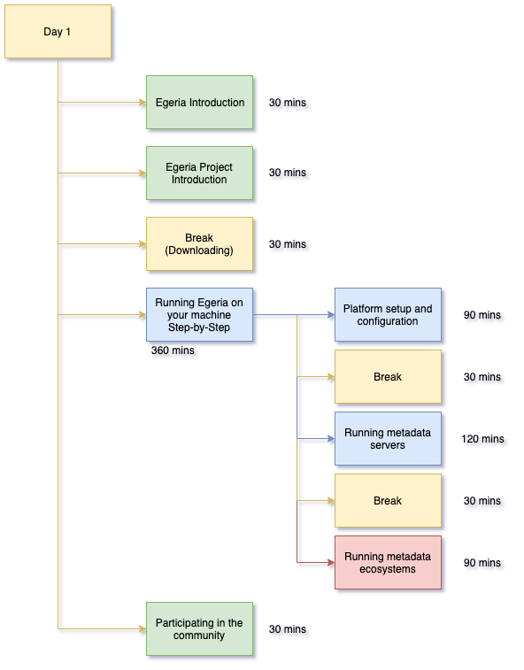
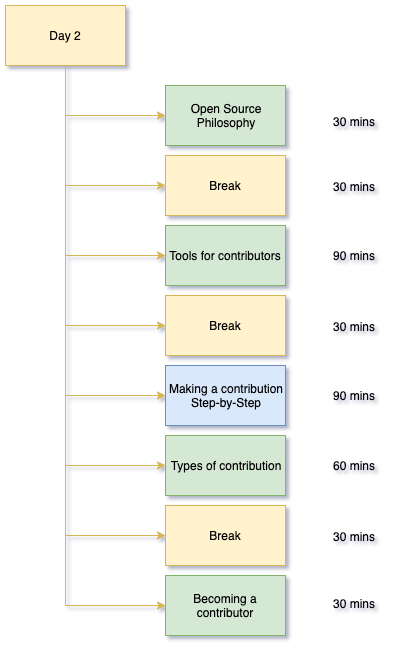
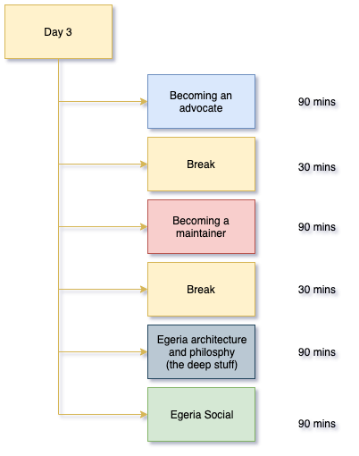

<!-- SPDX-License-Identifier: CC-BY-4.0 -->
<!-- Copyright Contributors to the ODPi Egeria project 2020. -->

# The Egeria Dojo

The Egeria Dojo is an intensive course to help you learn about Egeria.
It is designed as a 3 day effort, although, since it is self-study you can
dip in and out of it as time permits.

The objectives of the three day are as follows:

* **Day 1**: Learning about setting up and running Egeria on you own machine.
* **Day 2**: Learning how to make a contribution to Egeria
* **Day 3**: Learning how to become either an advocate or a maintainer

The sessions are color-coded like ski runs.

As you progress through the dojo, the colors of the sessions
show how advanced your knowledge is becoming.

The schedule also includes estimated times needed to complete
each session as well as breaks to give your mind a rest from time to time.

Also within the sessions are links to videos of the live sessions run
in May 2020.  These videos are  consolidated into single playlist on
YouTube here: [https://www.youtube.com/playlist?list=PLhfwwk2gl_5Y7ZE8kHjGKyuIEZMQ5Hkfp](https://www.youtube.com/playlist?list=PLhfwwk2gl_5Y7ZE8kHjGKyuIEZMQ5Hkfp) 

----

## Day 1

After completing day 1 of the Egeria dojo you should feel
comfortable with setting up and running the Egeria technology.
It includes sessions on the prerequisite technology that Egeria uses,
how to configure Egeria, how to start and stop various capabilities
and well as diagnosing any problems you may come across.

> **Day 1 Overview**

----
Links to content
* [Egeria Introduction](egeria-dojo-day-1-1-introduction.md)
* [Egeria Project Introduction](egeria-dojo-day-1-2-project-introduction.md)
* [Running Egeria on your Machine - Step-by-Step](egeria-dojo-day-1-3-running-egeria.md)
* [Participating in the Community](egeria-dojo-day-1-4-participating-in-the-community.md)

----

## Day 2

Day 2 of the Egeria dojo is all about making changes to the
Egeria project.  This may be to add code, documentation or samples.
You will have an opportunity to add a new file to the Egeria project
and take it all the way through the process to update Egeria's git repository.

> **Day 2 Overview**

----
Links to content:
* [Open Source Philosophy](egeria-dojo-day-2-1-open-source-philosophy.md)
* [Tools for Contributors](egeria-dojo-day-2-2-tools-for-contributors.md)
* [Making a contribution - Step-by-Step](egeria-dojo-day-2-3-contribution-to-egeria.md)
* [Types of Contribution](egeria-dojo-day-2-4-types-of-contribution.md)
* [Becoming a Contributor](egeria-dojo-day-2-5-becoming-a-contributor.md)

----

## Day 3

Day 3 prepares you to become an Egeria professional - either
as an advocate of the technology or a maintainer.
It goes much deeper into the philosophy, design and processes
of the project.

> **Day 3 Overview**

----
Links to content:
* [Becoming an advocate](egeria-dojo-day-3-1-becoming-an-advocate.md)
* [Becoming a maintainer](egeria-dojo-day-3-2-becoming-a-maintainer.png)
* [Egeria architecture and philosophy (the deep stuff)](egeria-dojo-day-3-3-egeria-architecture.md)
* [Egeria social](egeria-dojo-day-3-4-egeria-social.md)

## Video Links

On 26th-28th May 2020, the Egeria community ran three live sessions walking
through the dojo.  The videos are from these sessions.

* Watch a [video describing the Dojo](https://youtu.be/ECF4m0CAHY4)
* Link to the [YouTube play list for all of the recorded dojo sessions](https://www.youtube.com/watch?v=ECF4m0CAHY4&list=PLhfwwk2gl_5Y7ZE8kHjGKyuIEZMQ5Hkfp).

----
* Return to [Tutorials Menu](..)

----
License: [CC BY 4.0](https://creativecommons.org/licenses/by/4.0/),
Copyright Contributors to the ODPi Egeria project.