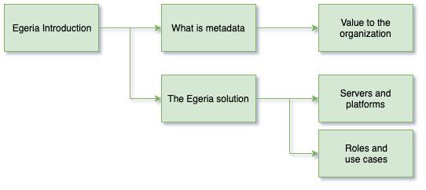

<!-- SPDX-License-Identifier: CC-BY-4.0 -->
<!-- Copyright Contributors to the ODPi Egeria project 2020. -->

# Egeria Introduction

In this session, you will learn about the function and value of Egeria
along with the key concepts and use cases it supports.

## Introductory presentation

This session provides background information to the Egeria project
using a presentation.

Watch a video of the presentation: [https://youtu.be/s249ofNoETY](https://youtu.be/s249ofNoETY).

The charts for the presentation are located here:
[https://github.com/odpi/data-governance/tree/master/workshops/may-2020/egeria-dojo-day-1-1-introduction.pptx](https://github.com/odpi/data-governance/tree/master/workshops/may-2020).

## Test yourself

* Which of the following are part of the **Open Metadata Manifesto**:
   1.  Metadata needs to be centralized so it can be managed.
   1.  Maintenance of metadata must be automated.
   1.  The availability of metadata management must become ubiquitous.
   1.  Metadata access must become open and remotely accessible.
* Name 3 tools that could connect to Egeria.
* Name a metadata standard.

----
* Progress to [Egeria Project Overview](egeria-dojo-day-1-2-project-introduction.md)

* Return to [Dojo Overview](.)

----
License: [CC BY 4.0](https://creativecommons.org/licenses/by/4.0/),
Copyright Contributors to the ODPi Egeria project.