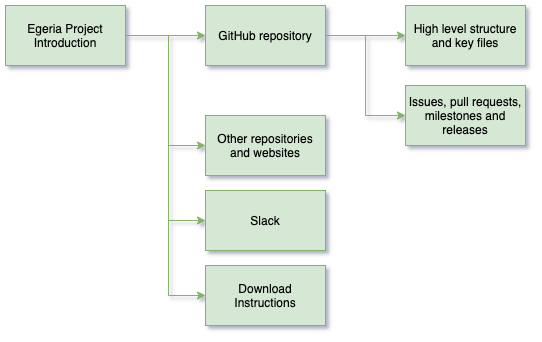

<!-- SPDX-License-Identifier: CC-BY-4.0 -->
<!-- Copyright Contributors to the ODPi Egeria project 2020. -->

# Egeria Project Introduction

In this session, you will learn about the contents of the Egeria project.
It will also describe the software to download in preparation for
the next session.

## Project Resources

Watch the project overview video: [https://youtu.be/CN81aeSlWlU](https://youtu.be/CN81aeSlWlU)

## GitHub repositories

[GitHub](https://github.com) is a public service for managing files - particularly files associated
with a software project.  Many open source projects use GitHub and egeria is no exception.

All of the content for the Egeria project is stored in git repositories.
For example, these web pages you are reading as part of the dojo are
managed in Egeria's main git repository
[here](https://github.com/odpi/egeria/tree/master/open-metadata-resources/open-metadata-tutorials/egeria-dojo).

Each directory in the repository has a README.md file written in [the Markdown standard](../../../developer-resources/tools/Markdown.md).
You can either click through on GitHub or link to the [Content Organization](../../../Content-Organization.md)
that lists the directories with descriptions.

## Other resources

The Egeria community love to collaborate on the work they do.  Git and GitHub is
an excellent way to exchange and manage files.  In addition, the community
runs public calls that anyone can join, as well as a number of slack channels.

Details of the different ways the community operates is described in our
[Community Guide](../../../Community-Guide.md).  Click on the link to the community guide
to find out more.

## Test yourself

* Name three of the git repositories owned by the Egeria Project
  and describe what they do.
  
* Describe why the Egeria project is called "egeria".

* Log on to the ODPi slack service and post a message to the  `#egeria-dojo-live`
 channel to say that you have got this far in the dojo.

## Downloads for next session

It is time for a break now. However, if you want to save time,
the next session makes use of Docker containers to run Egeria and Postman to issue REST API calls.
The links below provide information on how to download these tools during the break.

* [Docker Desktop](../../../developer-resources/tools/Docker.md)
* [Postman](../../../developer-resources/tools/Postman.md)

These download instructions will be presented again in the appropriate
session so it is not a problem if you do not download them now.

Now it is time to take a break before moving on to the next session.

----
* Progress to [Running Egeria on your machine Step-by-Step](egeria-dojo-day-1-3-running-egeria.md)

* Return to [Egeria Overview](egeria-dojo-day-1-1-introduction.md)
* Return to [Dojo Overview](.)

----
License: [CC BY 4.0](https://creativecommons.org/licenses/by/4.0/),
Copyright Contributors to the ODPi Egeria project.