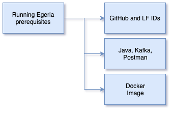

<!-- SPDX-License-Identifier: CC-BY-4.0 -->
<!-- Copyright Contributors to the ODPi Egeria project 2020. -->

# Running Egeria prerequisites

In this session, you will learn about the Open Metadata and Governance (OMAG) Server Platform that
hosts many of the services provided by Egeria.

However, before we get started there are some steps to prepare your machine.

For this session you will need both **Docker Desktop** and **Postman** running on your machine.

What the video for an overview of this session: [https://youtu.be/jnxY2epKgzY](https://youtu.be/jnxY2epKgzY)

Follow the links below to find out a little bit about these technologies and ensure the software
is installed.

* [Docker Desktop](../../../developer-resources/tools/Docker.md)
* [Postman](../../../developer-resources/tools/Postman.md)

Once these technologies are installed, work through the tutorials - starting with Docker to get the
OMAG Server Platform running and then Postman to get
ready to work with the platform and the servers running on top if it.

* [Docker Tutorial](../docker-tutorial)
* [Postman Tutorial](../postman-tutorial)

At this point you should have Postman installed with the collections loaded, and Egeria's OMAG Server Platform running
as a docker container.

## Test yourself

* What is the message from the OMAG Server Platform that says it is ready to process requests?
* How do you find out the version of Egeria running in an OMAG Server Platform?
* What is the url to view the Swagger UI page for the OMAG Server Platform?

----
* Progress to [Configuring the platform](egeria-dojo-day-1-3-1-2-configuring-the-platform.md)

* Return to [Platform set up and configuration](egeria-dojo-day-1-3-1-platform-set-up-and-configuration.md)
* Return to [Dojo Overview](.)

----
License: [CC BY 4.0](https://creativecommons.org/licenses/by/4.0/),
Copyright Contributors to the ODPi Egeria project.