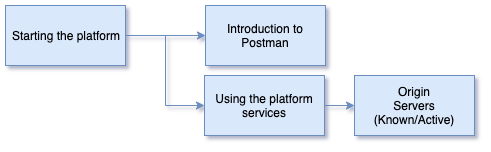

<!-- SPDX-License-Identifier: CC-BY-4.0 -->
<!-- Copyright Contributors to the ODPi Egeria project 2020. -->

# Configuring the OMAG Server Platform

In this session, you will learn how to set up the OMAG Server Platform.

Watch this video to get an overview of this session: [https://youtu.be/-YScFx0fQk0](https://youtu.be/-YScFx0fQk0).

In the previous session you downloaded an application called Postman and loaded collections of
pre-defined requests.
This tool makes it easy to issue REST API requests to the OMAG Server Platform.

Check that it is working by locating the `Get Server Origin` request in the 
`Egeria-platform-services` collection.
When you click on that request in the left-hand list, a new tab opens and you can click on send to
issue the request.  You should see the same response as when you issues the platform origin request from
[Swagger](../docker-tutorial) earlier.  Below is this response in Postman.

If this does not work, then there is something wrong either in Postman or your platform.
Check the URL string that was used in the request (shown in orange in the middle of the screen.)

The screen shot below shows the error message when the egeria environment is not set.
This can be fixed by setting it in the top right-hand dropdown.  If the Egeria environment is not
listed then you need to load the environment ([Postman tutorial](../postman-tutorial)).

If the baseURL variable is set to a different value to the server platform then Postman can not connect.
In the screen capture below, you can see the baseURL is set to the default of `https://localhost:9443` when it should be
`https://localhost:9443` because the platform is running in docker.

Finally, if the OMAG Server Platform is not running the even though everything is set up correctly in
Postman, it has nothing to connect to.  Restart the platform ([Docker tutorial](../docker-tutorial)).

In last part of this session you will learn how to set up the OMAG Server Platform so that it is secure and
determine the services and servers that are associated with the platform.

Review the description of the OMAG Server Platform configuration:

* [Configuring the OMAG Server Platform](../../../open-metadata-implementation/admin-services/docs/user/configuring-the-omag-server-platform.md)

The link below takes you to a task description in the Egeria Administration User Guide.
The user guide describes the REST API call(s) needed to complete the task.
You can choose to type the request into postman, or use the requests already defined in the
`Egeria-admin-services-platform-configuration` Postman collection.

* [Add the Coco Pharmaceuticals platform security connector to the platform](../../../open-metadata-implementation/admin-services/docs/user/configuring-the-platform-security-connector.md)
  Try running the platform origin command again - it should fail with a security error.  Change the `user` variable
  in the Egeria environment from `me` to `garygeeke` and rerun the request.  It will work again because
  `garygeeke` is the user id of the Coco Pharmaceuticals IT infrastructure lead and has permission to run the platform
  commands.

Finally, use the `Egeria-admin-services-platform-configuration` Postman collection to experiment with the
different registered services and and known and active server requests.
These are useful to know as we move to configure servers on the platform.

This is the end of the session on the OMAG Server Platform.

----
* Progress to [Configuring a metadata server on the platform](egeria-dojo-day-1-3-1-3-configuring-a-server.md)

* Return to [Platform set up and configuration](egeria-dojo-day-1-3-1-platform-set-up-and-configuration.md)
* Return to [Dojo Overview](.)

----
License: [CC BY 4.0](https://creativecommons.org/licenses/by/4.0/),
Copyright Contributors to the ODPi Egeria project.
